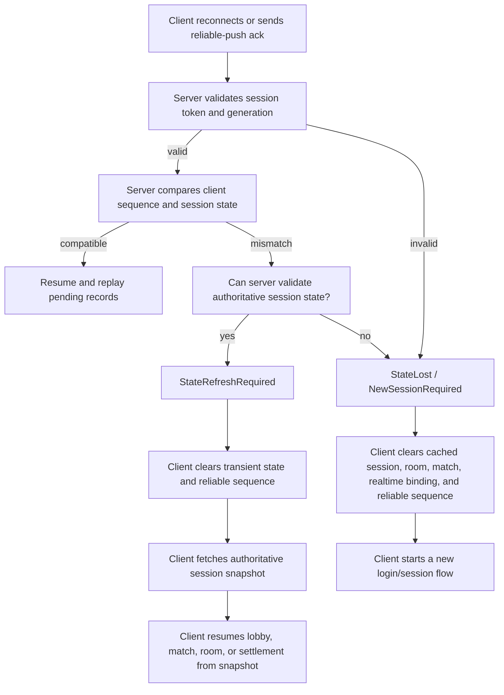

# Contributing

This document is for people working on the ULinkGame repository itself. User-facing package information belongs in `README.md`.

## Project Layout

```txt
src/
  ULinkGame.Abstractions/  Cross-side framework-owned session and reliable push primitives
  ULinkGame.Server/       Server-side hosting, Microsoft Orleans integration, reliable push outbox
  ULinkGame.Client/       Engine-neutral client helpers, currently reliable push tracking
  ULinkGame.Tool/         Project management tool entry point

samples/
  Agar.Unity/             Unity + .NET multiplayer sample
    docs/                 Sample gameplay design and development plan
    tests/                Sample gameplay and server policy tests
  Agar.Godot/             Godot .NET client sample

Tests/
  tests.slnx              Framework test entry point
  ULinkGame.Client.Tests/ Client package unit tests
  ULinkGame.Server.Tests/ Server package unit tests

docs/
  Hugo blog and user-facing article source
```

User-facing articles live in the Hugo site under root `docs/`. Repository-level architectural decisions and package-specific design notes are maintained in this guide when they affect package boundaries, server behavior, client behavior, or sample integration.

## Package Boundaries

### ULinkGame.Server

`ULinkGame.Server` is the server-side framework package. It currently owns:

- the `IULinkGameServer` main entry point for session, endpoint, and reliable push workflows
- hosting helpers for ULinkRPC server lifecycle
- Orleans client and silo integration helpers
- a generic reliable push outbox for business-level server push delivery
- extension points for project-specific RPC server configurators

It should stay infrastructure-oriented. Matchmaking rules, room rules, user DTOs, and gameplay state belong in the game project or sample, not in the framework core.

### ULinkGame.Client

`ULinkGame.Client` is an engine-neutral client helper package. It currently contains the `ULinkGameClient` main entry point plus lower-level reliable push and reconnect state helpers that can be reused by Unity, Godot, or plain .NET clients.

### ULinkGame.Abstractions

`ULinkGame.Abstractions` owns cross-side framework concepts that must be named and interpreted the same way by server and client packages:

- `GameSessionKey`
- `ReliablePushSequence`
- reliable push acknowledgement status values

It must stay small. User-owned contracts still belong in a game `Shared` project, and Unity-specific wrappers should wait until repeated integration code becomes stable enough to justify a package.

### ULinkGame.Tool

`ULinkGame.Tool` is the project tool package. Its command name is:

```bash
ulinkgame-tool
```

It is separate from runtime packages. Runtime code belongs in `ULinkGame.Server` or `ULinkGame.Client`; project scaffolding and maintenance commands belong in the tool.

Package README files under `src/ULinkGame.Abstractions`, `src/ULinkGame.Tool`, `src/ULinkGame.Server`, and `src/ULinkGame.Client` are user-facing package documentation. Keep contributor-only implementation policy, maintenance boundaries, release process, and design decisions in this `CONTRIBUTING.md` file instead of package README files.

#### ULinkGame.Tool Starter Boundary

In this repository's tool documentation, `starter` means `ulinkrpc-starter`, not `ULinkGame.Tool` or any internal ULinkGame scaffolding phase.

`ULinkGame.Tool` delegates the base project shape to `ulinkrpc-starter`. Treat `ulinkrpc-starter` generated ULinkRPC content as owned by `ulinkrpc-starter`, not by ULinkGame.

`ULinkGame.Tool` must not rewrite, replace, or version-pin starter-owned content:

- `ULinkRPC.*` package references and versions
- Unity, Tuanjie, Godot, or plain .NET client project structure
- generated RPC binding output locations, except through `ulinkgame.tool.json` codegen settings
- serializer and transport package selection beyond forwarding the user's `new` command options to `ulinkrpc-starter`

When `ulinkgame-tool new` augments a generated project, it should preserve starter output and add only ULinkGame-owned infrastructure:

- `ULinkGame.Server` and `ULinkGame.Client` package references when needed
- Orleans silo/edge hosting projects and configuration
- ULinkGame-specific server startup, gateway, and tool configuration
- project maintenance commands that delegate code generation back to the starter toolchain

If a generated project needs a different `ULinkRPC.*` package version or client layout, fix `ulinkrpc-starter` first and then update the `ulinkrpc-starter` version consumed by `ULinkGame.Tool`.

## Package Decision

### Background

The framework started as a thin server-hosting layer: it wired ULinkRPC servers, Microsoft Orleans, dependency injection, and process lifetime. Reliable business push changes that boundary. The framework now owns mechanics that must be understood by both sides of a game session:

- reconnect versus new-session decisions
- business push sequencing
- client acknowledgement semantics
- replay after reconnect
- state-mismatch handling when the server no longer has compatible session state

The old `Host` name now undersells the scope and can imply a server-only library.

### Decision

Rename the framework family to `ULinkGame`.

The first package split is:

- `ULinkGame.Abstractions`
- `ULinkGame.Server`
- `ULinkGame.Client`

Do not introduce `ULinkGame.Shared` yet.

Do not introduce `ULinkGame.Unity` yet.

### Why ULinkGame

`ULinkGame` clearly communicates that this layer is above raw RPC and standalone actor hosting, and is intended for game networking workflows. The relationship should be:

- `ULinkRPC`: transport, serialization, RPC calls, and generated bindings
- `Microsoft Orleans`: distributed actors, clustering, placement, and grain state
- `ULinkGame`: game-session infrastructure that integrates ULinkRPC and Microsoft Orleans
- user game code: matchmaking, room rules, gameplay state, rewards, inventory, and other domain features

This keeps the product line understandable without forcing a thick game framework.

### Why ULinkGame.Abstractions, Not ULinkGame.Shared

`ULinkGame.Abstractions` exists because session identity, reliable push sequence values, and acknowledgement outcomes are now genuinely shared framework concepts. Keeping these types in either `ULinkGame.Server` or `ULinkGame.Client` makes the opposite side depend on the wrong runtime package.

Do not rename this package to `ULinkGame.Shared`. Users already have:

- `ULinkRPC`
- their own shared RPC contract project
- server code
- client code

Adding `ULinkGame.Shared` too early creates a naming collision with user-owned `Shared` projects and makes it unclear where business DTOs should live.

For now, shared business contracts should remain in the user's own shared project. Examples:

- login request/reply DTOs
- matchmaking status payloads
- reliable sequence fields on business messages
- app-specific result codes

`ULinkGame.Abstractions` communicates framework-owned contracts only. Keep it limited to primitives that both runtime packages need.

### Why Not ULinkGame.Unity Now

Unity-specific integration is useful, but it should not be the first client package. The reusable core should not depend on:

- `MonoBehaviour`
- Unity main-thread APIs
- `Time.time`
- Unity logging
- Unity assembly definition layout

The first client package should be a plain .NET library. Unity projects can consume it through normal package/import mechanisms while keeping Unity-specific glue in the sample or in the user's project.

`ULinkGame.Unity` can be added later only when repeated Unity-specific integration code becomes stable enough to justify a package.

### First Client Library Boundary

`ULinkGame.Client` should own client-side mechanisms that are not engine-specific:

- latest applied reliable push sequence tracking
- duplicate reliable message detection
- ack decision helpers
- state-mismatch result handling
- reconnect state transitions that are independent of UI rendering

It should not own:

- Unity scene state
- UI text
- gameplay-specific callbacks such as `MatchmakingStatusUpdate`
- transport creation details unless they can be expressed through small interfaces

Unity sample code should remain responsible for:

- copying RPC DTOs into a main-thread inbox
- mutating Unity UI and scene state on the main thread
- choosing how to display reconnect/new-session outcomes
- calling generated RPC clients

### Migration Plan

1. Keep reusable framework code under `src/ULinkGame.Abstractions`, `src/ULinkGame.Server`, `src/ULinkGame.Client`, and `src/ULinkGame.Tool`.
2. Keep sample-owned `Shared`, `Server`, and `Client` projects under `samples/Agar.Unity`.
3. Keep business DTOs in the sample or consuming game's `Shared` project.
4. Keep cross-package framework decisions in this guide, package-specific design with the owning package when the scope is local, and sample design under `samples/Agar.Unity/docs`.
5. Replace sample-local reliable sequence bookkeeping with `ULinkGame.Client` where practical.

### Compatibility Note

During early development, breaking namespace and project-name changes are acceptable. Once packaged, add compatibility shims or a migration guide only if external users already depend on older package names.

## Samples

The repository currently contains two sample clients:

```txt
samples/Agar.Unity/
  Shared/  MemoryPack contracts and shared gameplay kernel
  Server/  .NET server, Orleans silo, WebSocket control plane, KCP realtime plane
  Client/  Unity client

samples/Agar.Godot/
  Godot .NET client playground that consumes ULinkGame.Client from NuGet and references Agar.Unity/Shared
```

`samples/Agar.Unity` demonstrates:

- a Unity client plus .NET server game layout
- WebSocket as the long-lived control connection
- KCP for realtime gameplay traffic
- reconnect-aware login flow
- business-level reliable push for server notifications
- an agar-style arena built on a shared simulation kernel

`samples/Agar.Godot` is intentionally smaller. It is an offline Godot .NET client playground that reuses the shared agar gameplay kernel and `ULinkGame.Client` reliable push helpers.

Sample-specific documentation and local infrastructure live with the sample:

- `samples/Agar.Unity/README.md`
- `samples/Agar.Unity/docs/GAMEPLAY_DESIGN.md`
- `samples/Agar.Unity/docs/DEVELOPMENT_PLAN.md`
- `samples/Agar.Unity/docker-compose.yml`
- `samples/Agar.Unity/.env.example`
- `samples/Agar.Unity/dotnet-tools.json`
- `samples/Agar.Unity/infra/`

Run the sample server pieces separately:

```powershell
dotnet run --project samples/Agar.Unity/Server/Silo/Silo.csproj
dotnet run --project samples/Agar.Unity/Server/Edge/Edge.csproj
```

Open `samples/Agar.Unity/Client` in Unity for the client.

Open `samples/Agar.Godot` in Godot 4 .NET for the Godot client playground.

## Build And Test

Build framework projects:

```powershell
dotnet build src/ULinkGame.Abstractions/ULinkGame.Abstractions.csproj
dotnet build src/ULinkGame.Server/ULinkGame.Server.csproj
dotnet build src/ULinkGame.Client/ULinkGame.Client.csproj
dotnet build src/ULinkGame.Tool/ULinkGame.Tool.csproj
```

Build and run unit tests:

```powershell
dotnet test Tests/tests.slnx
```

Sample-specific tests live with their sample, for example `samples/Agar.Unity/tests/BusinessLogic.Tests`.

The Unity project may generate local `Library`, `Temp`, `obj`, and restored NuGet package folders. These are ignored and should not be committed.

## NuGet Release

Framework packages are published to nuget.org by the `Publish NuGet` GitHub Actions workflow:

```txt
.github/workflows/publish-nuget.yml
```

The workflow runs automatically on pushes to `main` when one of these paths changes:

- `.github/workflows/publish-nuget.yml`
- `Directory.Build.props`
- `NuGet.config`
- `src/**`
- `Tests/**`

The workflow uses .NET `10.0.x`, restores all test and package projects, runs the client and server package tests, packs every project under `src/*/*.csproj`, then pushes all generated `.nupkg` files to nuget.org with `--skip-duplicate`.

The packages currently published by this workflow are:

- `ULinkGame.Abstractions`, versioned in `src/ULinkGame.Abstractions/ULinkGame.Abstractions.csproj`
- `ULinkGame.Client`, versioned in `src/ULinkGame.Client/ULinkGame.Client.csproj`
- `ULinkGame.Server`, versioned in `src/ULinkGame.Server/ULinkGame.Server.csproj`
- `ULinkGame.Tool`, versioned in `src/ULinkGame.Tool/ULinkGame.Tool.csproj`

Release credentials are managed through the GitHub `release` environment. The workflow uses `NuGet/login@v1` with the `NUGET_USER` secret and then passes the action-provided temporary API key to `dotnet nuget push`.

To release a new package version:

1. Update the `<Version>` in the owning `.csproj`.
2. Update `CHANGELOG.md` with the released package id and version.
3. Update generated template constants or sample package references if the released package is consumed by scaffolding or samples.
4. Run the relevant local tests before merging.
5. Merge or push to `main`; the GitHub Actions workflow publishes the packages.

Useful local checks:

```powershell
dotnet test Tests/tests.slnx
dotnet pack src/ULinkGame.Abstractions/ULinkGame.Abstractions.csproj -c Release -o artifacts/nuget
dotnet pack src/ULinkGame.Client/ULinkGame.Client.csproj -c Release -o artifacts/nuget
dotnet pack src/ULinkGame.Server/ULinkGame.Server.csproj -c Release -o artifacts/nuget
dotnet pack src/ULinkGame.Tool/ULinkGame.Tool.csproj -c Release -o artifacts/nuget
```

## Design Boundary

ULinkGame should not become a full game business framework. Keep the boundary narrow:

- Framework: connection lifecycle, host integration, session infrastructure, reliable push mechanics, reusable client state helpers.
- Game project: accounts, matchmaking policy, room rules, gameplay simulation, UI, persistence schema, and product-specific DTOs.

When a capability is only useful to one sample, keep it under that sample in `samples/`. Move it into `src` only when it is demonstrably reusable across games.

## Endpoint Model Boundary

ULinkGame should support multiple named RPC endpoints or channels, but it should not force every game to understand a fixed "control connection plus realtime connection" split.

The reusable framework capability is:

- host several named ULinkRPC servers in the same .NET process
- let projects choose transport, serializer, endpoint names, and lifecycle policy
- provide connection/session lifecycle helpers that can work with one endpoint or several endpoints
- keep logging, health checks, and diagnostics understandable per endpoint

The default user mental model should remain simple: one session endpoint can handle login, normal requests, reliable business push, and reconnect for light online games.

The control/realtime split is an optional architecture for games that need high-frequency, low-latency gameplay traffic. In that model:

- the control endpoint handles login, matchmaking, room entry, settlement, low-frequency queries, and reliable business push
- the realtime endpoint handles input, snapshots, and other high-frequency gameplay traffic

This split belongs in samples or templates that explicitly opt into realtime multiplayer. It should not become a mandatory package concept, and starter output should avoid introducing realtime attach, room runtime, or dual-connection terminology unless the selected project shape needs it.

## Reliable Business Push Design

### Problem

Server callbacks are currently fire-and-forget at the business layer. A transport can report that a push write was accepted, while the target player reconnects before the client applies the business event.

Example:

1. Players A and B enter matchmaking.
2. The server creates a room and pushes `Matched` to both clients.
3. A receives and handles the push.
4. B reconnects during the push window.
5. The old connection is gone, but the server has no business-level proof that B handled `Matched`.
6. B may stay on the waiting screen forever.

The transport can reduce packet loss, but it cannot prove that the client applied a business event after a reconnect. The fix needs to be above transport: reliable, idempotent business push.

### Recommended Model

Use at-least-once delivery with per-player monotonic sequence numbers.

This is a better fit than trying to implement exactly-once delivery:

- Exactly-once is not realistic across reconnects, retries, client crashes, and server failover.
- At-least-once plus idempotent client handling is predictable and common in game control-plane flows.
- Sequence numbers let clients discard duplicates and let servers prune acknowledged messages.
- The mechanism is generic enough for `ULinkGame.Server`; matchmaking, rooms, mail, rewards, and other features can opt in without entering host core as business concepts.

### Layering

`ULinkGame.Server` owns the generic mechanism:

- allocate a per-owner sequence number
- store pending reliable push records
- replay pending records after reconnect
- accept acknowledgements and prune old records
- apply retention and pending-count limits

Business code owns business semantics:

- choose which push messages require reliability
- include the reliable sequence in its payload
- expose an ack RPC or piggyback ack on an existing request
- make client handlers idempotent by ignoring already applied sequence numbers

This keeps `ULinkGame.Server` as host infrastructure rather than a matchmaking or room framework.

### Message Flow

Publishing a reliable push:

1. Business code asks `IReliablePushOutbox` to publish a payload for `ownerKey`.
2. The outbox assigns `sequence = lastSequence(ownerKey) + 1`.
3. The outbox stores `{ ownerKey, sequence, kind, payload }`.
4. The business delivery delegate sends the payload to the current callback, including `sequence`.
5. If the current callback is missing or disconnected, the record stays pending.

Acknowledging:

1. The client applies the business message.
2. The client sends the latest applied sequence to the server.
3. The outbox removes records with `sequence <= latestAppliedSequence`.

Reconnecting:

1. The client reconnects through normal login/resume flow.
2. The server rebinds the new callback.
3. The server calls `ReplayPendingAsync(ownerKey, deliver)`.
4. Pending records are pushed again through the new callback.
5. The client ignores duplicates whose sequence is not newer than its local latest applied sequence.

### State Mismatch

Reliable push must also handle the case where the client believes it is resuming a valid session, but the server no longer has compatible state. This can happen when:

- the client stayed offline beyond the reconnect grace period
- the gateway process restarted and lost its in-memory outbox
- server-side cleanup removed the session before the client returned

The server should not silently accept this as a successful reconnect. It must return an explicit "state lost" result and require a new session.

Prefer authoritative-state refresh before declaring the session lost:



There are two detection points:

- `LoginAsync(reconnect: true)`: before accepting the reconnect, the server verifies that the session still exists and that the token matches. If not, it returns a reconnect-state-lost code.
- reliable push ack: if the client acknowledges a sequence greater than the server's last known sequence, the server knows the client has state from a different or expired server session. The ack response should request a new session.

Client behavior:

1. Stop treating the current flow as recoverable.
2. Clear cached realtime room, pending callbacks, and latest reliable sequence.
3. Start a normal login/new-session flow instead of retrying reconnect.
4. Return the player to a coherent lobby or login state; do not leave them on a stale matchmaking or in-match screen.

### Persistence

The default outbox is process-local and in-memory. Reliable push is a short-window, low-frequency control-plane notification mechanism, not a durable business event log and not the source of truth for game state.

If a server process restarts or otherwise loses the outbox, the server should not pretend that replay is still possible. It should return an explicit state-lost result when reconnect or acknowledgement proves that the client has state the server can no longer validate. The client must then clear local session state, reset reliable sequence tracking, and start a new session or return to a coherent lobby/login flow.

Business code should recover from missing reliable pushes through authoritative state queries when the authoritative state still exists. If the authoritative state is gone, forcing a new session is preferred over replaying stale notifications.

Projects may still replace `IReliablePushOutbox` with a durable implementation for specialized low-frequency business events, but that is a project-specific choice. A durable outbox must preserve consistency with the authoritative business state and absorb the added performance, storage, retention, and operations costs. It should not be the ULinkGame default or a reason to turn framework reliable push into a general event-sourcing system.

### Retention

Reliable push is not an infinite event log.

Defaults:

- pending retention: 2 minutes
- max pending records per owner: 256

If a client does not reconnect and ack within the retention window, business code must recover via authoritative state queries or force the player back to a coherent screen.

### Client Rules

Clients must:

- store the latest applied reliable sequence per player/session
- apply messages only when `sequence > latestAppliedSequence`
- ack only after the UI/session state transition has been applied
- tolerate receiving the same business message more than once

### Current Sample Integration

The sample uses reliable push for `MatchmakingStatusUpdate`, because missing `Matched` blocks the user flow.

`WorldState` is intentionally not reliable through this mechanism. It is high-frequency realtime state and should be replaced by newer snapshots, not replayed as history.

Implementation points:

- `ULinkGame.Server.ReliablePush.IReliablePushOutbox` is the generic host-level abstraction.
- `ULinkGame.Server.ReliablePush.InMemoryReliablePushOutbox` is the current short-gap implementation.
- `Server.Services.ReliableMatchmakingPublisher` adapts matchmaking status pushes to the generic outbox.
- `IPlayerService.AckReliablePushAsync` is the sample ack RPC.
- `MatchmakingStatusUpdate.ReliableSequence` carries the sequence to the Unity client.
- The Unity client acks after applying a newer sequence and ignores duplicate older sequences.

## ULinkGame.Client API Direction

`ULinkGame.Client` should expose `ULinkGameClient` as the recommended main entry point. `ReliablePushTracker.Decide(...)`, `MarkApplied(...)`, `Reset()`, and `ReliablePushInbox` remain useful lower-level building blocks, but application code should not have to manually preserve the correct order:

1. decide whether a push is new
2. apply the business payload
3. mark the sequence as applied only after successful application
4. acknowledge the latest applied sequence
5. react to state-lost or session-mismatch acknowledgement results

That order is easy to get wrong. The main client API should keep the low-level primitives available, but make the correct inbox/session flow natural.

The preferred shape is:

```csharp
public sealed class ULinkGameClient
{
    public ClientSessionSnapshot Snapshot { get; }

    public void StartSession(GameSessionKey session, long lastReliableSequence = 0);

    public void EndSession();

    public ValueTask<ReliablePushProcessResult> ProcessReliablePushAsync<TPayload>(
        ReliablePushSequence sequence,
        TPayload payload,
        Func<TPayload, CancellationToken, ValueTask> applyAsync,
        Func<ReliablePushAck, CancellationToken, ValueTask<ReliablePushAckOutcome>> acknowledgeAsync,
        CancellationToken cancellationToken = default);
}
```

Usage should be closer to:

```csharp
await client.ProcessReliablePushAsync(
    ReliablePushSequence.From(update.ReliableSequence),
    update,
    applyAsync: ApplyMatchmakingUpdateAsync,
    acknowledgeAsync: ack => playerService.AckReliablePushAsync(ack, ct),
    ct);
```

The API should avoid bool-heavy result types. Prefer explicit enums and value objects:

```csharp
public enum ReliablePushDecisionKind
{
    ApplyAndAck,
    AckDuplicate,
    RejectNoSession,
    RejectSessionMismatch
}

public enum ReliablePushAckStatus
{
    Accepted,
    Duplicate,
    StateRefreshRequired,
    StateLost,
    SessionMismatch
}

public readonly struct GameSessionKey { }

public readonly struct ReliablePushSequence { }

public readonly struct ReliablePushAck
{
    public GameSessionKey Session { get; }
    public ReliablePushSequence Sequence { get; }
}
```

Reliable sequence state should be scoped to a session or generation, not only to a player id. This prevents a new session from acknowledging an old session's sequence and gives the client a clean reset boundary after `StateLost` or `NewSessionRequired`.

`ReliablePushSequence` should be a value object for positive reliable sequences. Messages without a positive reliable sequence are not reliable push messages and should bypass this API instead of being treated as a special reliable case.

Client-side cursor storage can be added behind an engine-neutral interface:

```csharp
public interface IReliablePushCursorStore
{
    ValueTask<long> LoadAsync(GameSessionKey session, CancellationToken cancellationToken = default);

    ValueTask SaveAsync(GameSessionKey session, long sequence, CancellationToken cancellationToken = default);

    ValueTask ClearAsync(GameSessionKey session, CancellationToken cancellationToken = default);
}
```

The framework can provide an in-memory implementation. Unity, Godot, and application-specific persistence should stay in the consuming project unless repeated glue code becomes stable enough to justify a separate package.

Implementation order:

1. Add shared session and reliable push primitives to `ULinkGame.Abstractions`.
2. Keep `ReliablePushTracker` and `ReliablePushInbox` as lower-level primitives.
3. Recommend `ULinkGameClient` in user-facing documentation.
4. Keep Unity/Godot persistence and engine dispatch outside the framework.

## Framework Architecture Roadmap

This section records architecture guidance for framework work that is worth extracting from samples into `src/`. These are design targets, not completed capabilities. Keep every item infrastructure-oriented and avoid importing Agar-specific DTOs, account rules, matchmaking policy, room rules, gameplay simulation, leaderboard rules, or Unity UI.

### ULinkGame.Server.Sessions

Goal: provide reusable server-side session lifecycle primitives without defining the game's account model, login RPC, token format, room model, or callback DTOs.

The package should live under `ULinkGame.Server.Sessions` and own these generic concepts:

- session identity: owner key, session id, generation, created time, last seen time
- endpoint binding: endpoint name, connection id, callback object, bind time, disconnect time
- lifecycle decisions: new session, resume accepted, state refresh required, state lost, unauthorized
- cleanup policy: disconnect grace period, max idle session age, endpoint-specific detach rules
- extension hooks: token validation, authoritative state probe, optional custom metadata

Suggested API shape:

```csharp
public sealed record GameSessionKey(
    string OwnerKey,
    string SessionId,
    long Generation);

public sealed record SessionEndpointKey(
    GameSessionKey Session,
    string EndpointName);

public enum SessionResumeStatus
{
    Resumed,
    StateRefreshRequired,
    StateLost,
    Unauthorized
}

public sealed record SessionResumeDecision(
    SessionResumeStatus Status,
    GameSessionKey? Session,
    string? Reason = null);

public interface IGameSessionDirectory
{
    ValueTask<GameSessionKey> StartNewSessionAsync(
        string ownerKey,
        CancellationToken cancellationToken = default);

    ValueTask<SessionResumeDecision> TryResumeAsync(
        GameSessionKey session,
        CancellationToken cancellationToken = default);

    ValueTask BindEndpointAsync<TCallback>(
        SessionEndpointKey endpoint,
        string connectionId,
        TCallback callback,
        CancellationToken cancellationToken = default)
        where TCallback : class;

    ValueTask MarkEndpointDisconnectedAsync(
        SessionEndpointKey endpoint,
        string? connectionId = null,
        CancellationToken cancellationToken = default);

    ValueTask<TCallback?> GetCallbackAsync<TCallback>(
        SessionEndpointKey endpoint,
        CancellationToken cancellationToken = default)
        where TCallback : class;
}
```

The exact API can change during implementation, but keep these constraints:

- Store generated RPC callback instances as opaque typed bindings. Framework code must not know callback methods such as `OnMatched`.
- Treat endpoint names as data. `control` and `realtime` are sample/template names, not mandatory framework concepts.
- Scope reliable sequence tracking to `GameSessionKey` or an equivalent generation-bearing identity.
- The first implementation should be in-memory and process-local. Durable session stores are project-specific until repeated use proves a framework need.
- Token validation should be a hook, not a framework account system.

Implementation order:

1. Extract a minimal in-memory directory from the sample shape: start session, bind endpoint, detach endpoint, expire disconnected endpoints.
2. Add generation-aware resume decisions and state-lost result types.
3. Wire reliable push ack/session checks to the session identity instead of plain player id.
4. Add cleanup hosted service helpers only after the directory API is stable.
5. Add diagnostics counters and logs for start, resume, bind, detach, expire, state refresh, and state lost.

Test requirements:

- duplicate bind replaces only the matching endpoint binding
- stale connection id cannot detach a newer binding
- control-like and realtime-like endpoint bindings can be independently detached
- session generation prevents old acknowledgements from affecting new sessions
- expired sessions return `StateLost`, not silent success

### Reconnect And State-Lost Semantics

Goal: make reconnect outcomes explicit and shared by server and client helpers while still letting the game decide what authoritative state means.

ULinkGame should distinguish three cases:

- `Resumed`: session token, generation, and authoritative state are compatible; pending reliable pushes can be replayed.
- `StateRefreshRequired`: the session is valid but transient client state or reliable sequence state is stale; client must clear transient state and fetch an authoritative snapshot.
- `StateLost`: the server cannot validate the client's claimed state; client must clear session-local state and start a new session.

Suggested server-side result types:

```csharp
public enum ReconnectStatus
{
    Resumed,
    StateRefreshRequired,
    StateLost,
    Unauthorized
}

public enum ReliablePushAckStatus
{
    Accepted,
    Duplicate,
    StateRefreshRequired,
    StateLost,
    SessionMismatch
}
```

The framework should provide decision helpers, not business snapshots. A game should be able to plug in an authoritative state probe:

```csharp
public interface IAuthoritativeSessionStateProbe<TSnapshot>
{
    ValueTask<AuthoritativeStateProbeResult<TSnapshot>> ProbeAsync(
        GameSessionKey session,
        CancellationToken cancellationToken = default);
}
```

Guidance:

- Never repair state mismatch by replaying untrusted or stale reliable pushes.
- If authoritative state exists, prefer `StateRefreshRequired` and let the client fetch a snapshot.
- If authoritative state does not exist, return `StateLost` or `NewSessionRequired`.
- If a client acknowledges a sequence for a different session/generation, return `SessionMismatch` or `StateLost`.
- Do not silently reset sequence numbers on the server while treating reconnect as successful; make the reset visible through an explicit result.

Implementation order:

1. Add framework result types for reconnect and ack outcomes.
2. Update client helper design to consume those outcomes.
3. Add sample migration after framework primitives exist.
4. Add docs showing the difference between replay, refresh, and new session.

Test requirements:

- valid session and compatible sequence returns resume/accepted
- valid session with missing transient outbox but existing authoritative state returns refresh required
- invalid token returns unauthorized
- missing authoritative state returns state lost
- old generation ack does not mutate the current generation cursor

### Cross-Gateway Realtime Routing

Goal: provide optional infrastructure for realtime multiplayer deployments where a player's current RPC connection and a room/runtime owner may live on different gateway processes.

This is not required for light online games. It should live under an optional namespace such as `ULinkGame.Server.RealtimeRouting` and remain independent of any gameplay DTO.

Framework-owned concepts:

- gateway identity: stable node id, endpoint addresses, health state
- route key: application-defined key such as room id, match id, or shard id
- runtime owner: the gateway currently authoritative for a route key
- routed envelope: ordered key, expiration time, payload, content type, correlation id
- delivery result: accepted, expired, no owner, backpressure, failed

Suggested API shape:

```csharp
public sealed record GatewayNodeId(string Value);

public sealed record RealtimeRouteKey(string Value);

public sealed record RealtimeRouteOwner(
    RealtimeRouteKey Route,
    GatewayNodeId Gateway,
    DateTimeOffset ExpiresAt);

public sealed record RealtimeEnvelope(
    RealtimeRouteKey Route,
    string Kind,
    ReadOnlyMemory<byte> Payload,
    string? OrderedBy = null,
    DateTimeOffset? ExpiresAt = null,
    string? CorrelationId = null);

public enum RealtimeRouteSendStatus
{
    Accepted,
    Expired,
    NoOwner,
    Backpressure,
    Failed
}

public interface IRealtimeRouteRegistry
{
    ValueTask RegisterOwnerAsync(RealtimeRouteOwner owner, CancellationToken cancellationToken = default);

    ValueTask<RealtimeRouteOwner?> GetOwnerAsync(RealtimeRouteKey route, CancellationToken cancellationToken = default);

    ValueTask ClearOwnerAsync(RealtimeRouteKey route, GatewayNodeId gateway, CancellationToken cancellationToken = default);
}

public interface IRealtimeMessageRouter
{
    ValueTask<RealtimeRouteSendStatus> SendAsync(
        RealtimeEnvelope envelope,
        CancellationToken cancellationToken = default);
}
```

Guidance:

- Do not serialize live RPC callback objects into Redis, Orleans state, streams, or route records.
- Payload serialization belongs to the application or adapter. The framework route layer can move bytes plus metadata.
- Ordering should be scoped by an explicit key such as player id or route id, not globally.
- Expiration is mandatory for high-frequency realtime messages; stale inputs and stale snapshots should be dropped, not replayed indefinitely.
- Backpressure must be visible through return values and metrics.
- Provide adapters later, for example Orleans streams, Redis pub/sub, or in-process loopback. Start with an in-memory adapter for tests.

Implementation order:

1. Define route registry and router abstractions with in-memory implementation.
2. Add route owner registration and expiration tests.
3. Add send result, TTL, and backpressure behavior.
4. Add one production adapter only after the sample proves the abstraction.
5. Migrate Agar multi-gateway routing as the first real consumer.

Test requirements:

- only one active owner is returned for a route
- owner expiration makes the route unavailable
- expired envelopes are dropped before delivery
- no-owner and backpressure are surfaced as explicit statuses
- callback objects never appear in serialized route state

### Engine-Neutral Client Session State

Goal: give Unity, Godot, and plain .NET clients reusable state helpers without depending on an engine, generated RPC client, transport package, UI thread, or local storage mechanism.

This layer should build on `ReliablePushInbox`, not replace it.

Suggested concepts:

- client session identity: owner key, session id, generation
- connection phase: signed out, connecting, active, reconnecting, refresh required, state lost
- endpoint state: disconnected, connecting, connected, failed
- transient state reset: reliable sequence cursor, endpoint binding, pending local callbacks
- application hooks: connect, disconnect, fetch snapshot, start new session

Suggested API shape:

```csharp
public enum ClientSessionPhase
{
    SignedOut,
    Connecting,
    Active,
    Reconnecting,
    RefreshRequired,
    StateLost
}

public sealed record ClientSessionSnapshot(
    ClientSessionPhase Phase,
    GameSessionKey? Session,
    long LastReliableSequence);

public sealed class ClientSessionController
{
    public ClientSessionSnapshot Snapshot { get; }

    public void StartSession(GameSessionKey session, long lastReliableSequence = 0);

    public void MarkReconnecting();

    public void ApplyAckOutcome(ReliablePushAckOutcome outcome);

    public void MarkStateLost();

    public void EndSession();
}
```

Guidance:

- Keep it synchronous where possible; async belongs to app-provided connect/fetch delegates.
- Do not dispatch to Unity main thread, Godot main loop, or SynchronizationContext inside the framework.
- Do not store UI text or user-visible messages.
- Do not create transports or generated RPC clients.
- Provide snapshots and explicit transitions so applications can render their own UI and logs.
- Make `StateLost` terminal until `StartSession` is called again.

Implementation order:

1. Implement `ReliablePushInbox`.
2. Add session/generation-aware cursor store.
3. Add `ClientSessionController` with pure transition tests.
4. Add README examples for Unity/Godot/plain .NET without engine dependencies.

Test requirements:

- state lost clears reliable sequence and endpoint-like transient state
- refresh required does not imply new login
- new session starts with isolated cursor
- duplicate push ack outcome does not change phase
- all transitions are deterministic and engine-neutral

### Diagnostics, Health Checks, And Metrics

Goal: make ULinkGame infrastructure observable without hard-coding any game's business metrics.

Use standard .NET primitives:

- `ILogger` for structured logs
- `System.Diagnostics.Metrics` for counters, histograms, and gauges
- `Microsoft.Extensions.Diagnostics.HealthChecks` for readiness/liveness checks where applicable

Suggested namespaces:

- `ULinkGame.Server.Diagnostics`
- `ULinkGame.Server.Hosting` for endpoint hosted-service diagnostics
- `ULinkGame.Server.ReliablePush` for outbox metrics
- `ULinkGame.Server.Sessions` for session lifecycle metrics once sessions exist
- `ULinkGame.Server.RealtimeRouting` for routing metrics once routing exists

Suggested metrics:

- `ulinkgame.rpc.endpoint.started`
- `ulinkgame.rpc.endpoint.stopped`
- `ulinkgame.rpc.endpoint.failure`
- `ulinkgame.reliable_push.published`
- `ulinkgame.reliable_push.replayed`
- `ulinkgame.reliable_push.acked`
- `ulinkgame.reliable_push.pending`
- `ulinkgame.session.started`
- `ulinkgame.session.resumed`
- `ulinkgame.session.state_lost`
- `ulinkgame.route.sent`
- `ulinkgame.route.dropped`
- `ulinkgame.route.backpressure`

Suggested health checks:

- Orleans client connected for gateway processes
- Orleans silo started for silo processes
- configured RPC endpoints have started listening
- reliable push outbox service is registered
- optional route backend is reachable

Guidance:

- Metrics must use low-cardinality tags. Endpoint name, status, and reason category are acceptable; player id, room id, session id, and connection id are not.
- Logs may include correlation ids and endpoint names, but avoid secrets and raw tokens.
- Framework diagnostics should expose infrastructure behavior. Business events such as score, ranking, rewards, or inventory belong to the game.
- Health checks should separate liveness from readiness. A process can be alive but not ready to accept RPC traffic.

Implementation order:

1. Add stable event ids and log scopes for RPC endpoint startup/shutdown/failure.
2. Add reliable push counters and pending gauge.
3. Add health checks for Orleans client/silo and endpoint hosted service state.
4. Add session and routing metrics when those packages exist.
5. Update tool templates to register health checks in generated server projects.

Test requirements:

- endpoint startup failure is logged with endpoint name
- reliable push publish/replay/ack increments metrics through a test meter listener
- health check reports unhealthy when required services are missing or not started
- metrics do not tag high-cardinality user/session/room identifiers

### ULinkGame.Tool Production Templates

Goal: generate production-ready infrastructure scaffolding without taking ownership of ULinkRPC starter output or game business code.

The tool currently creates an Edge/Silo layout and unconditionally generates control and realtime endpoints. Future work should split templates by project shape:

- simple online game: one session endpoint
- realtime multiplayer game: session/control endpoint plus optional realtime endpoint
- server-only or client-engine variants only when supported by `ulinkrpc-starter`

Template-owned additions:

- `ULinkGame.Server` and `ULinkGame.Client` package references
- Edge/Silo host startup using ULinkGame helpers
- environment-variable driven `appsettings.json`
- `.env.example` with development-only defaults
- optional Dockerfile and compose/override files for Edge and Silo
- health check registration and endpoint
- local tool manifest and codegen command wiring
- README next steps that match the selected project shape

Template non-goals:

- do not rewrite `ULinkRPC.*` package versions generated by `ulinkrpc-starter`
- do not own game RPC contracts, business DTOs, account schema, leaderboard schema, or room rules
- do not generate realtime endpoint terminology for simple single-endpoint projects
- do not include production secrets or real connection strings

Suggested options:

```txt
ulinkgame-tool new --name MyGame --client-engine unity --network-profile simple
ulinkgame-tool new --name MyGame --client-engine unity --network-profile realtime
ulinkgame-tool new --name MyGame --client-engine unity --with-docker
ulinkgame-tool new --name MyGame --client-engine unity --with-health-checks
```

The exact option names can change, but the project shape should be explicit. Avoid making realtime multiplayer the implicit default for every new project.

Implementation order:

1. Introduce an internal `NetworkProfile` model with `simple` and `realtime`.
2. Make the existing dual-endpoint template the `realtime` profile.
3. Add a simple single-endpoint template and make it the default if that does not break existing users.
4. Add Docker/compose/health-check output behind explicit options.
5. Update verification scripts to generate and build both profiles.

Test requirements:

- simple profile generates exactly one endpoint configurator
- realtime profile generates separate session/control and realtime configurators
- generated projects build after codegen
- generated appsettings can be overridden by environment variables
- Docker template does not contain secrets
- tool still preserves starter-owned package references and generated layout

## Unfinished Framework Features

This list tracks framework-level gaps only. Do not use it for sample gameplay, account systems, matchmaking policy, room rules, leaderboard rules, Unity UI, persistence schema, or other game-owned work.

### P0 Session Reliability Milestone

These four modules are the highest-priority framework work. Implement them as one dependency chain: explicit state semantics first, session identity second, reliable push session scoping third, and engine-neutral client state last.

#### StateLost Semantics

Status:

- [x] Add framework result enums and outcome types for reconnect/ack decisions.
- [x] Add reliable push ack decision helper for accepted, duplicate, session mismatch, and state lost outcomes.
- [x] Add authoritative state probe abstraction for state refresh versus state lost decisions.
- [x] Migrate Agar sample login and ack result mapping to framework outcome types.
- [x] Document replay versus refresh versus new-session behavior in package READMEs.

#### Session Lifecycle

Status:

- [x] Add `ULinkGame.Server.Sessions` session identity, endpoint identity, resume decision, and in-memory directory primitives.
- [x] Add service registration for the in-memory session directory.
- [x] Support typed opaque callback bindings by endpoint name.
- [x] Prevent stale connection ids from detaching newer endpoint bindings.
- [x] Make session generation changes return `StateLost` instead of silent success.
- [x] Add token validation hook.
- [x] Add authoritative state probe integration.
- [x] Add cleanup hosted service helpers after the directory API stabilizes.
- [x] Migrate Agar sample `SessionDirectory`/`PlayerService` to the framework directory.

#### Reliable Push

Status:

- [x] Keep existing in-memory reliable push outbox for publish/replay/ack/prune.
- [x] Add session/generation-aware ack outcome primitives.
- [x] Add shared `GameSessionKey`, `ReliablePushSequence`, `ReliablePushAck`, `ReliablePushInbox`, and cursor store primitives.
- [x] Add tests for duplicate handling, cursor isolation, and old-generation/session mismatch outcomes.
- [x] Wire server ack helper directly into `IReliablePushOutbox` or an adjacent ack service.
- [x] Scope server-side pending records to `GameSessionKey` or equivalent generation-bearing identity.
- [x] Migrate Unity sample from `ReliablePushTracker` to `ReliablePushInbox`.
- [x] Migrate Godot sample from `ReliablePushTracker` to `ReliablePushInbox`.

#### Engine-Neutral Client State

Status:

- [x] Add `ClientSessionPhase`, `ClientSessionSnapshot`, and `ClientSessionController`.
- [x] Keep client state helpers synchronous and free of Unity, Godot, transport, generated RPC client, and UI dependencies.
- [x] Make `StateLost` clear reliable state and remain terminal until `StartSession`.
- [x] Add deterministic pure transition tests.
- [x] Add README examples for Unity, Godot, and plain .NET usage.
- [x] Migrate sample reconnect/state-lost handling to `ClientSessionController`.

### Candidate Framework Work

- Endpoint model cleanup: `ULinkGame.Server` can host multiple named RPC servers, but `ULinkGame.Tool` still generates a control endpoint and realtime endpoint unconditionally. The tool should eventually offer a simple single-endpoint project shape by default and only generate realtime endpoint code when the selected template explicitly needs realtime multiplayer.
- Optional realtime routing infrastructure: no framework abstraction exists yet for gateway-to-gateway routing, runtime owner identity, ordered input forwarding, snapshot fanout, or endpoint-level backpressure. If added, this should remain optional infrastructure for realtime multiplayer templates, not a mandatory concept for light online games.
- Endpoint diagnostics and operations: the framework does not yet provide built-in per-endpoint health checks, readiness signals, structured log event ids, metrics hooks, graceful endpoint shutdown semantics, or standard diagnostics for reliable push and session lifecycle decisions.

### Deliberately Not Default Work

- Durable reliable push is not a default framework goal. The default remains an in-memory short-window outbox plus explicit state-lost/new-session behavior when authoritative state cannot be validated.
- `ULinkGame.Shared` is not planned. Cross-side framework-owned contracts belong in `ULinkGame.Abstractions`; user-owned business DTOs belong in the game's own shared contract project.
- `ULinkGame.Unity` is not planned until repeated Unity-specific integration code becomes stable enough to justify a package.
- Game business systems stay out of the framework: accounts, matchmaking policy, room rules, gameplay simulation, rewards, inventory, leaderboard rules, UI, and product DTOs belong in the game project or sample.
