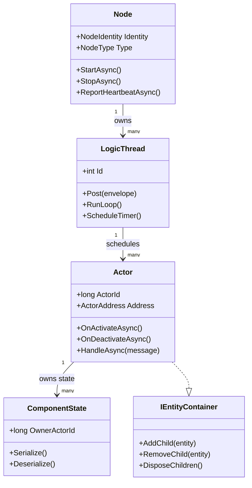
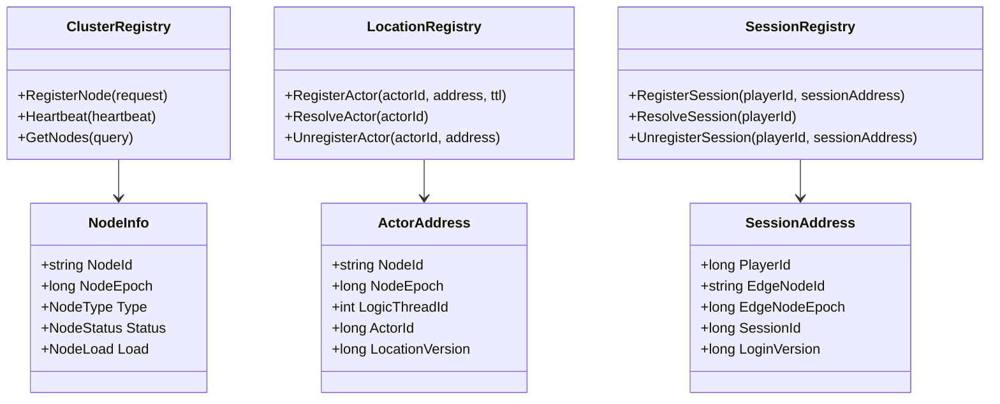
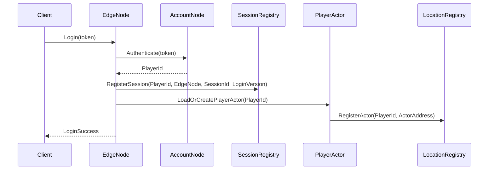
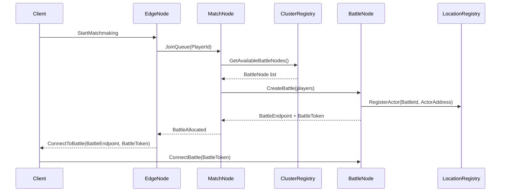
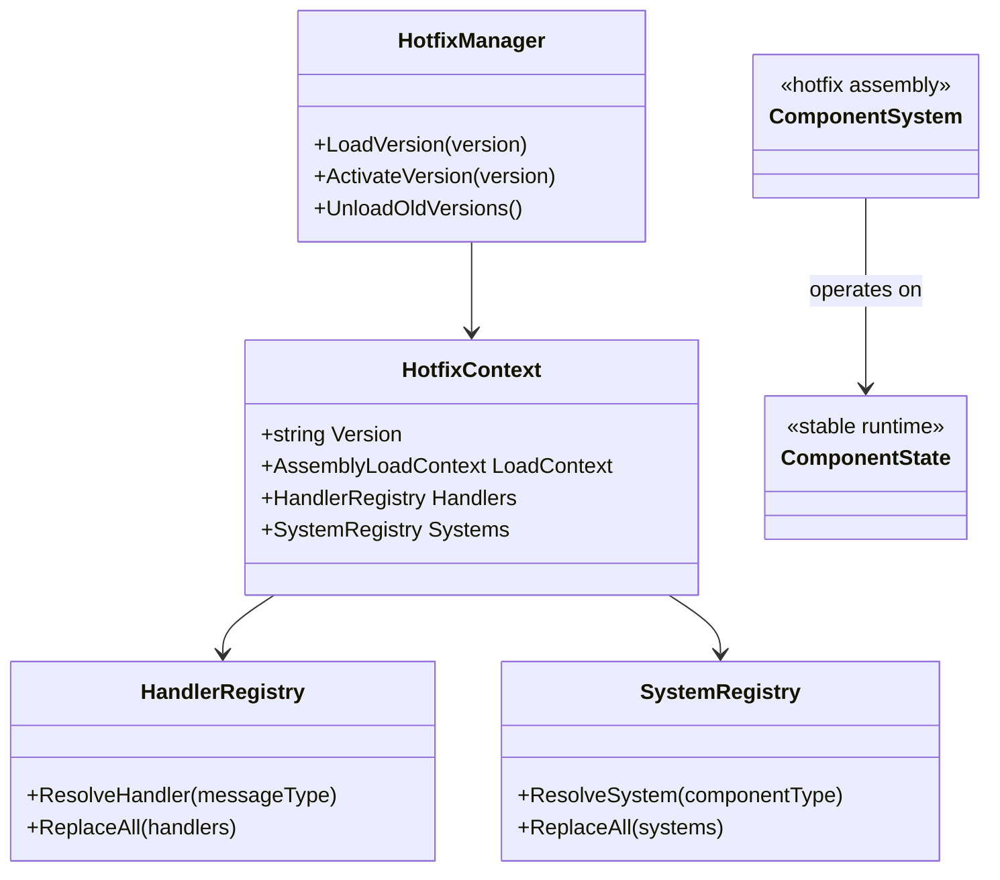

# ULinkGame 架构设计

> 状态：Draft 0.1  
> 设计原则：面向低延迟实时多人游戏和零停机热更的 .NET 游戏服务器运行时

---

## 1. 背景和决策

ULinkGame 原本使用 ULinkRPC 处理客户端/服务端 RPC，使用 Microsoft Orleans 处理分布式 actor、集群、放置和有状态 grain。对于低延迟实时多人游戏来说，这种拆分很别扭：

- Edge 进程拥有客户端连接和实时传输。
- Orleans grain 拥有大量权威服务端状态。
- 实时战斗执行要么跨过额外的进程/运行时边界，要么在 edge 代码和 grain 代码之间重复概念。
- 放置、路由、背压和失败语义被隐藏在高层 actor 抽象之后，而这个抽象并不是为高频游戏循环量身设计的。

新的方向是自底向上重建。ULinkGame 不再把 Orleans 当作分布式运行时，而是自己拥有一个面向游戏服务器的小型 actor 模型和分布式 RPC 层。

这些参考项目可以作为设计输入，但不是要整体照搬的框架：

- GeekServer：.NET actor 执行、代码生成和游戏服务器工程体验。
- SparkServer：C# 中的 skynet 风格 service/server 分层。
- ET：Unity 客户端加 C# 服务端的组织方式、fiber/runtime 概念、服务发现和游戏工作流集成。
- skynet：轻量在线游戏 service 模型、显式消息传递和简单的分布式心智模型。

核心决策：

- 用 ULinkGame 自有 actor runtime 和分布式 actor RPC 栈替换 Orleans。
- 主要服务端进程是 edge actor host：接受 ULinkRPC 连接，拥有会话状态，可本地运行实时战斗 actor，并在需要时把 actor 消息路由到其他节点。
- 不做 Orleans 兼容层。现有样例和模板应该迁移，而不是通过 compatibility shim 保留。

目标能力：

- 低延迟实时多人逻辑。
- 便于热更的业务逻辑。
- 分布式部署。
- Unity/.NET 客户端-服务端集成。
- 清晰的服务端对象模型，同时不绑定 Orleans、ET 或任何单一现有框架。

非目标：

- 不重建一个完整的 Orleans 克隆。
- 不提供隐藏失败、延迟和背压的透明分布式对象。
- 不让每个 actor 默认自动持久化。
- 不把账号系统、匹配规则、房间规则、排行榜策略、背包、奖励或玩法 DTO 放进 ULinkGame Core。
- 不要求每个游戏都使用独立的控制端点和实时端点。
- 不让 Unity、Godot 或任何引擎运行时成为服务端包依赖。
- 第一版不实现 automatic actor migration、distributed transactions、exactly-once RPC、battle live migration、fully decentralized registry、Raft-based cluster consensus、cross-node shared mutable objects。

---

## 2. Core 纳入规则

一个概念只有同时满足以下条件，才能进入 ULinkGame Core：

1. 它不是玩法语义。
2. 它是运行时基础设施。
3. 它对不同游戏品类都仍然有用。
4. 它支持低延迟在线玩法。
5. 它支持零停机热更。

推荐进入 Core 的概念：

- `Node`：集群中的独立进程实例。
- `LogicThread`：单线程逻辑执行域，负责 Mailbox、Tick、Timer 和 Actor 调度。
- `Actor`：有稳定 Id 的消息处理对象。
- `Mailbox`：Actor 的逻辑消息队列。
- `Router` / `Location`：Actor 寻址和跨节点投递基础设施。
- `Timer`：延迟任务、超时检测、周期性逻辑和 Tick 调度。
- `Session`：客户端连接和玩家绑定的逻辑抽象。
- `Cluster Registry`：Node 注册、心跳、节点状态和服务发现。
- `ComponentState` / `ComponentSystem`：状态和逻辑分离的基础抽象。
- `Hotfix loading boundary`：热更代码和稳定 Runtime 之间的隔离边界。
- `Internal RPC abstraction`：集群内部通信抽象层。
- `Metrics` / `Logging`：运行时监控和日志接口。

不推荐进入 Core：

- 作为强制运行时原语的 Scene
- World/Map 模型
- BattleRoom 模型
- Skill/Buff/Quest/Inventory/Guild 实现
- Matchmaking 实现
- AOI 实现

---

## 3. 高层架构

```text
Client
  ⇅ external transport: WebSocket / TCP / KCP / UDP
EdgeNode / GateNode
  ⇅ internal RPC / Actor Router
Game Cluster
  ├── AccountNode
  ├── PlayerNode
  ├── MatchNode
  ├── BattleNode
  ├── ChatNode
  ├── RankingNode
  └── RegistryNode
```

运行时分为两个平面：

### 3.1 控制平面

负责生命周期、发现、分配、路由、状态和编排。

示例：

- 节点注册；
- 节点心跳；
- actor location 注册；
- session location 注册；
- 战斗服务器分配；
- 部署状态；
- draining 和 shutdown。

### 3.2 数据平面

负责高频游戏逻辑和客户端通信。

示例：

- 玩家输入；
- 战斗 tick；
- 快照广播；
- 聊天投递；
- 低延迟推送。

实时战斗流量应该避免不必要的中间跳转。对于 MOBA 类玩法，理想路径是：

```text
Client ⇄ BattleNode
```

而不是：

```text
Client → EdgeNode → BattleNode → EdgeNode → Client
```

EdgeNode 仍然可以用于认证、路由、大厅和非战斗会话。

### 3.3 包职责

- `ULinkGame.Abstractions`：跨端框架原语，例如会话身份、端点名、恢复结果、可靠推送序列和 ack 结果。
- `ULinkGame.Client`：引擎无关的客户端状态辅助能力，用于重连、可靠推送和会话阶段。
- `ULinkGame.Server`：actor runtime、ULinkRPC hosting 集成、会话生命周期、可靠推送、actor RPC 路由和诊断。
- `ULinkGame.Tool`：项目脚手架和 codegen 编排。它应该生成 ULinkGame actor-host 布局，而不是 Orleans silo 布局。

---

## 4. 运行时模型

ULinkGame Core 使用以下层级：

```text
Node
 └── LogicThread
      └── Actor
           └── ComponentState / ChildEntity
```

`Scene` 被刻意排除在强制层级之外。

游戏可以在业务层定义 `WorldScene`、`DungeonScene`、`BattleRoom` 或 `MatchLobby` 等领域根对象，Core 只提供 Actor、生命周期、组件状态、消息投递、Timer 和 Tick。

---

## 5. Node

`Node` 是参与 ULinkGame 集群的服务端进程。

示例：

- `EdgeNode`
- `BattleNode`
- `PlayerNode`
- `MatchNode`
- `ChatNode`
- `RegistryNode`

职责：

- 进程级身份；
- 服务监听；
- 内部 RPC endpoint；
- 向 cluster registry 注册；
- 心跳上报；
- 负载上报；
- 拥有多个 LogicThread；
- 优雅 draining 和 shutdown。

### 5.1 Node 状态

```text
Starting → Ready → Draining → Offline
                 ↘ Suspect → Dead
```

### 5.2 Node 身份

节点身份必须包含 epoch/generation，以区分重启后的进程。

```csharp
public readonly record struct NodeIdentity(
    string ClusterName,
    string NodeId,
    long NodeEpoch
);
```

`NodeId` 可以在重启之间保持稳定，但 `NodeEpoch` 必须在每次进程重新注册时变化。

这可以防止陈旧消息被错误投递到新的进程实例。

---

## 6. LogicThread

`LogicThread` 是 ULinkGame 的核心执行域。

它用更明确的游戏服务器术语替代含义模糊的 `Fiber`。

LogicThread 具备以下特征：

- 从游戏逻辑视角看是单线程的；
- 由 mailbox 驱动；
- 支持 timer；
- 可选 tick 驱动；
- 负责执行分配给它的 actor；
- 是可变对象不能直接跨越共享的边界。

### 6.1 核心规则

一个 Actor 在任意时刻只属于一个 LogicThread。

```text
ActorId → NodeId + NodeEpoch + LogicThreadId
```

在同一个 LogicThread 内，可以在该 LogicThread 拥有的对象之间进行直接同步调用。

跨 LogicThread 或跨 Node 时，通信必须使用消息传递。

### 6.2 LogicThread 循环

概念循环：

```csharp
while (running)
{
    ProcessMailbox();
    UpdateTimers();
    UpdateActors();
    FlushOutgoingMessages();
    SleepUntilNextTickOrWorkAvailable();
}
```

对于 battle LogicThread，推荐使用固定 tick 模式。

对于普通 service LogicThread，事件驱动模式可以接受。

### 6.3 推荐的 LogicThread 类型

```text
BattleLogicThread  - fixed tick, real-time simulation
PlayerLogicThread  - player actors and account-bound state
ChatLogicThread    - chat rooms and channels
GuildLogicThread   - guild actors
SystemLogicThread  - registry, control, scheduler
```

这些不一定是 Core 类。它们可以由每种 Node 类型自行实现。

---

## 7. Actor

Actor 是一个有稳定 Id 的消息处理对象。

在 ULinkGame 中，Actor 由所属 LogicThread 执行，并通过 Mailbox 串行处理消息，以避免并发状态竞争并保证同一 Actor 内的执行顺序可推理。

Actor 不是线程，也不是网络连接。它是由所属 LogicThread 执行的消息目标。

### 7.1 Actor 规则

- Actor 状态只能在其所属 LogicThread 上修改。
- Actor handler 不得长时间阻塞 LogicThread。
- Actor 可以拥有 component state 或 child entity。
- 外部可寻址 Actor 需要注册到 Location service。
- 只有当两个 actor 位于同一个 LogicThread 且被明确允许时，才允许跨 Actor 直接调用。
- 跨 LogicThread 或跨 Node 调用必须经过 Router。

### 7.2 推荐 Actor 分类

ULinkGame 不应该硬编码游戏业务 actor 类型，但文档和模板可以推荐常见分类：

- `PlayerSessionActor`：登录会话、端点绑定、重连状态、可靠推送游标。
- `MatchmakingActor`：队列状态和匹配分配。
- `RoomActor`：房间元数据、参与者列表、生命周期。
- `BattleActor`：实时 tick、输入应用、快照生成、结算触发。
- `LeaderboardActor`：排行榜周期和后端存储查询的协调。

实时战斗状态通常应该位于拥有该房间的 edge/BattleNode 上的 `BattleActor` 中。低频协调可以通过 actor RPC 调用其他 actor。

### 7.3 最小 Actor Runtime API

第一版 actor runtime API 应该刻意保持很小：

```csharp
public readonly record struct ActorId(string Value);

public interface IActor;

public interface IActorRuntime
{
    ValueTask TellAsync<TActor>(
        ActorId id,
        Func<TActor, CancellationToken, ValueTask> message,
        CancellationToken cancellationToken = default)
        where TActor : class, IActor;

    ValueTask<TResult> AskAsync<TActor, TResult>(
        ActorId id,
        Func<TActor, CancellationToken, ValueTask<TResult>> message,
        CancellationToken cancellationToken = default)
        where TActor : class, IActor;
}
```

之后可以引入 actor reference，但第一版设计应该避免让远程调用看起来太像普通方法调用。远程 actor 调用可能因为路由、超时、过载、owner 迁移或序列化问题失败。这些结果应该是可见的。

### 7.4 Mailbox 设计

推荐每个 Actor 一个逻辑 mailbox，但底层由所属 LogicThread 统一队列和调度器承载。

不要真的给每个 Actor 一个独立线程或阻塞队列。Actor mailbox 是逻辑队列，执行权属于 LogicThread。

消息入口流程：

```text
外部消息
  -> NodeReceiver
  -> LogicThread.InboundQueue
  -> ActorMailbox(target).Enqueue
  -> LogicThread.ActorScheduler
  -> Actor.Dispatch
```

第一版 mailbox 语义：

- 一个 Actor 一个逻辑 mailbox。
- 一个 LogicThread 承载多个 Actor mailbox。
- 同一 Actor 的消息 FIFO。
- 同一 Actor 同一时刻最多一个 handler 在执行。
- 每次调度最多处理 N 条消息或执行 T 毫秒后让出，避免单个 Actor 饿死同一 LogicThread 上的其他 Actor。
- 支持 deadline/timeout；过期消息可以在 dispatch 前丢弃或返回超时结果。
- 支持 mailbox length、queue delay、dropped count、handler latency 等监控指标。

建议消息结构：

```csharp
public sealed record ActorEnvelope(
    ActorId Target,
    ActorId? Sender,
    string MessageName,
    object Payload,
    long Sequence,
    DateTimeOffset EnqueuedAt,
    DateTimeOffset? Deadline,
    string? CorrelationId = null);
```

`EnqueuedAt` 用于统计排队延迟，`Deadline` 用于控制过期消息，`CorrelationId` 用于 request/reply、日志追踪和跨节点诊断。

Actor handler 不应该在 LogicThread 上等待外部 I/O。需要外部 I/O 时，应把请求交给外部异步组件，I/O 完成后通过新消息回投 Actor。这样可以保持 LogicThread 简单、稳定，并避免一个 Actor 的 I/O 等待阻塞同一 LogicThread 上的其他 Actor。

---

## 8. Entity 和 Component State

ULinkGame 应该支持基于 component 的状态组织方式，但不应该强迫所有玩法对象进入沉重的 entity 层级。

推荐设计是：

```text
Stable Runtime Assembly:
- Entity base
- Actor base
- ComponentState base
- serialization contracts
- lifecycle interfaces

Hotfix Assembly:
- Component systems
- message handlers
- gameplay rules
- calculation logic
```

### 8.1 状态和逻辑分离

为了支持热更，状态和逻辑应该分离。

推荐：

```csharp
// Stable assembly
public sealed class BagState : ComponentState
{
    public Dictionary<int, ItemState> Items { get; } = new();
}

// Hotfix assembly
public sealed class BagSystem : IComponentSystem<BagState>
{
    public void AddItem(BagState state, int itemId, int count)
    {
        // replaceable logic
    }
}
```

避免：

```csharp
public sealed class BagComponent
{
    public Dictionary<int, ItemState> Items { get; } = new();

    public void AddItem(int itemId, int count)
    {
        // state and logic mixed together
    }
}
```

第二种方式会让热更卸载变得困难，因为存活的 component 实例会保留对旧程序集类型的引用。

### 8.2 Entity Tree 边界

Entity tree 应该表达生命周期 ownership，而不是所有业务关系。

正确用法：

```text
PlayerActor
 ├── BagState
 ├── QuestState
 └── SessionState
```

错误用法：

```text
GuildActor
 └── PlayerActor
```

Guild 不拥有 player 生命周期。它应该引用 `PlayerId`。

### 8.3 Ownership 与 Reference

ULinkGame 必须区分：

```text
Ownership: who destroys this object?
Reference: who points to this object?
```

生命周期关系可以使用 parent-child ownership。

业务关系应该使用显式 reference、索引或 registry lookup。

---

## 9. Scene 作为用户层概念

`Scene` 不应该成为强制性的 ULinkGame Core 原语。它经常来自 MMO/map-based 架构，但很多房间制、大厅制、比赛制或移动游戏并不需要持久 world scene。

Core 只提供生命周期容器能力。游戏可以在业务层定义 `WorldScene`、`DungeonScene`、`BattleRoom`、`MatchLobby` 等根对象。

---

## 10. Location 和 Router

Scene/LogicThread 隔离会带来一个新问题：

```text
If direct references are forbidden across execution boundaries, how does one object find another object?
```

这个问题由 Location 和 Router 解决。

### 10.1 Location

Location 把逻辑对象标识符映射到物理地址。

```csharp
public readonly record struct ActorAddress(
    string NodeId,
    long NodeEpoch,
    int LogicThreadId,
    long ActorId,
    long LocationVersion
);
```

示例：

```text
PlayerId:10001 → player-node-1@epoch-17 / logic-thread-2 / actor-10001
BattleId:90001 → battle-node-2@epoch-9 / logic-thread-5 / actor-90001
```

### 10.2 Router

Router 基于 Location 投递消息。

概念流程：

```text
Sender
  → Router.Resolve(targetActorId)
  → LocationService
  → ActorAddress
  → NodeTransport.Send(address.NodeId, envelope)
  → TargetNode
  → TargetLogicThread mailbox
  → TargetActor handler
```

### 10.3 Router Cache

Router 可以缓存 Location 结果以提升性能。

规则：

- cache entry 应该使用短 TTL；
- send 失败时应该触发重新 resolve；
- 可行时必须检查 LocationVersion；
- stale address failure 应该是正常情况，而不是致命错误。

---

## 11. Session Location

Actor Location 不等于客户端连接 Location。

Session Location 把玩家映射到当前 Edge/Gate 连接。

```csharp
public readonly record struct SessionAddress(
    long PlayerId,
    string EdgeNodeId,
    long EdgeNodeEpoch,
    long SessionId,
    long LoginVersion
);
```

Session Location 用于：

- push message；
- 踢掉旧登录；
- 重连；
- 路由客户端消息；
- 判断玩家是否在线。

### 11.1 Login Version

每次成功登录都应该递增或分配新的 `LoginVersion`。

这可以防止陈旧 session 覆盖更新的 session。

### 11.2 会话和可靠推送集成

现有 ULinkGame session/reconnect 概念仍然有效，但应该变得 actor-runtime aware。

会话生命周期：

- `StartSession` 创建带 generation 的会话身份。
- endpoint binding 是按 session 和 endpoint name 作用域管理的不透明 callback binding。
- 重连验证 session token 和 generation。
- `Resumed`、`StateRefreshRequired`、`StateLost` 和 `Unauthorized` 仍然是显式结果。

可靠推送：

- 可靠业务推送仍然是 at-least-once，并使用每个 session 单调递增 sequence。
- ack 按 `GameSessionKey` 作用域管理。
- 只有在 session state 兼容时才 replay。
- 如果热 outbox 丢失但权威状态存在，优先返回 `StateRefreshRequired`。
- 如果无法验证权威状态，返回 `StateLost`。

长期形态很可能是 `PlayerSessionActor` 为单个玩家会话拥有 session state、endpoint binding、可靠推送 cursor/outbox policy。

---

## 12. 内部 RPC 策略

ULinkGame 第一版不应该要求自定义内部 RPC 实现。推荐方式：

```text
External client RPC: ULinkRPC
Internal cluster RPC: abstraction first, mature implementation first
Actor routing semantics: ULinkGame-owned
```

关键区别：

```text
RPC transport ≠ Actor Runtime ≠ Router ≠ Location
```

### 12.1 内部 RPC 抽象

```csharp
public interface INodeTransport
{
    ValueTask SendAsync(NodeIdentity targetNode, ActorEnvelope envelope, CancellationToken ct = default);

    ValueTask<TResponse> CallAsync<TResponse>(
        NodeIdentity targetNode,
        ActorRequest request,
        CancellationToken ct = default);
}
```

第一版实现候选：

- MagicOnion/gRPC 用于 control-plane 和普通内部调用；
- 如果协议统一变得重要，后续再引入 ULinkRPC internal transport。

不要把 Actor/Router 设计直接绑定到 gRPC 或 MagicOnion。

### 12.2 分布式 Actor RPC 结果语义

分布式 actor RPC 是 ULinkGame 服务端节点之间的框架自有语义层。它可以运行在成熟内部 RPC transport 之上，但语义属于 ULinkGame。

核心概念：

- `NodeId`：稳定的运行时节点身份。
- `ActorAddress`：actor 类型/类别加 `ActorId`。
- `RouteOwner`：当前负责某个 actor 或 route key 的节点。
- `ActorEnvelope`：序列化后的消息 payload、目标 actor address、correlation id、deadline。
- `ActorRpcResult`：accepted、completed、timeout、no owner、overloaded、stale route、failed。

路由必须保持显式：

```text
ActorId -> placement/routing table -> owner NodeId -> local mailbox or remote actor RPC
```

远程 actor 调用必须有 deadline。fire-and-forget 实时消息应该有短 TTL，并且可以被丢弃。控制面命令可以使用 request/reply，但显式 timeout 和 retry policy 由调用方拥有。

---

## 13. 集群管理

第一版应该使用简单的中心化 Registry，而不是复杂的去中心化共识系统。

### 13.1 Registry 职责

Registry 维护：

1. Node registry
2. Actor location registry
3. Session registry

它可以实现为专用的 `RegistryNode` 服务。

分阶段存储选项：

```text
Phase 1: in-memory + snapshot
Phase 2: Redis/PostgreSQL/etcd-backed
Phase 3: replicated registry / leader election if needed
```

### 13.2 Node 注册流程

```text
1. Node starts
2. Node reads ClusterName / NodeType / endpoints
3. Node connects to Registry
4. Node calls RegisterNode
5. Registry assigns NodeEpoch and lease
6. Node starts heartbeat
7. Node reports Ready after initialization
```

### 13.3 Lease 和 Heartbeat

Node 注册应该基于 lease。

示例：

```text
HeartbeatInterval = 3s
LeaseDuration = 15s
DeadTimeout = 30s
```

如果 heartbeat 过期：

```text
Ready → Suspect → Dead
```

当节点被标记为 Dead：

- 它不能再接收新分配；
- 它拥有的临时 location 应该失效；
- 受影响系统应该收到失败通知；
- battle session 可以按游戏策略中止或恢复。

### 13.4 Draining

关闭前，节点进入 `Draining`：

- 不应该再给它分配新 actor；
- 现有 session 可以继续直到完成；
- battle node 可以等待现有 battle 结束；
- edge node 可以拒绝新登录或重定向新登录。

---

## 14. 热更设计

热更是仅次于低延迟的核心需求。

推荐模型：

```text
Docker image: stable runtime and infrastructure
Hotfix DLL: replaceable business logic
```

### 14.1 Hotfix Boundary Rule

长期存活的可变状态不应该被定义为 hotfix assembly 类型的 live instance。

优先使用：

```text
Stable State + Hotfix Logic
```

这样可以在保留运行时状态的同时替换逻辑程序集。

### 14.2 AssemblyLoadContext

热更可以使用 collectible `AssemblyLoadContext` 实现。

重要约束：

- 切换后不能有对旧 hotfix 类型的强引用；
- 必须移除来自旧程序集的 delegate；
- timer 和 callback 必须重新绑定；
- handler registry 必须支持版本切换；
- 旧的 in-flight message 必须在卸载前完成或被拒绝。

### 14.3 热更范围

推荐热更：

- business handlers；
- component systems；
- gameplay rules；
- 非结构性计算；
- activity/event logic。

第一版不推荐热更：

- LogicThread runtime；
- Actor base；
- component state schema；
- network layer；
- serializer core；
- internal RPC protocol structure；
- low-level battle loop scheduler。

大型结构性变更应该使用 Docker rolling deployment。

---

## 15. 战斗 Runtime 设计

实时战斗逻辑是一等需求。

### 15.1 战斗放置

一场战斗应该直接运行在 BattleNode 上，最好位于固定 tick 的 BattleLogicThread 中。

```text
BattleNode
 ├── BattleLogicThread-1
 │    ├── BattleRoom-1001
 │    └── BattleRoom-1002
 └── BattleLogicThread-2
      ├── BattleRoom-1003
      └── BattleRoom-1004
```

### 15.2 战斗通信

最佳实时路径：

```text
Client ⇄ BattleNode
```

控制路径：

```text
Client → EdgeNode → MatchNode → BattleNode allocation
```

分配完成后，客户端可以使用 battle token 直接连接到 BattleNode。

### 15.3 战斗失败

第一版不应该尝试 live battle migration。

BattleNode 失败时：

- 标记节点为 Dead；
- 标记受影响 battle 为 Aborted；
- 通知玩家；
- 按游戏策略补偿；
- 如果合适，不计为失败。

未来版本可以添加：

- input log；
- deterministic replay；
- periodic snapshot；
- 在另一个 BattleNode 上恢复。

---

## 16. Mermaid 图

### 16.1 Runtime 层级



### 16.2 Cluster Registry



### 16.3 Router 消息流程

```mermaid
sequenceDiagram
    participant Sender as Sender Actor/Edge
    participant Router as ActorRouter
    participant Location as LocationRegistry
    participant Transport as NodeTransport
    participant Node as TargetNode
    participant LT as Target LogicThread
    participant Actor as TargetActor

    Sender->>Router: Send(targetActorId, message)
    Router->>Location: ResolveActor(targetActorId)
    Location-->>Router: ActorAddress
    Router->>Transport: Send(NodeId, ActorEnvelope)
    Transport->>Node: Deliver envelope
    Node->>LT: Post to mailbox
    LT->>Actor: Handle(message)
```

### 16.4 登录和 Session 注册



### 16.5 战斗分配



### 16.6 Hotfix Loader



---

## 17. 推荐包布局

```text
src/
  ULinkGame.Abstractions/
    Actor/
    Cluster/
    Routing/
    Components/
    Hotfix/
    Transport/

  ULinkGame.Runtime/
    Node/
    LogicThread/
    Mailbox/
    Timers/
    ActorRuntime/
    Lifecycle/

  ULinkGame.Cluster/
    Registry/
    Location/
    Session/
    NodeDiscovery/

  ULinkGame.Transport.Grpc/
    GrpcNodeTransport

  ULinkGame.Transport.ULinkRPC/
    ULinkRpcNodeTransport

  ULinkGame.Hotfix/
    HotfixManager
    AssemblyLoadContext integration
    HandlerRegistry
    SystemRegistry

  ULinkGame.Edge/
    EdgeNode host
    Session management
    Client gateway

  ULinkGame.Battle/
    BattleNode host
    BattleLogicThread sample
    BattleRoom sample

  ULinkGame.Samples/
    MinimalLogin
    MinimalBattle
    MinimalChat
```

### 17.1 Tool 模板方向

`ulinkgame-tool new` 应该生成 actor-host 项目：

```text
Server/
  Edge/
    Edge.csproj
    Program.cs
    Hosting/
    Actors/
Shared/
Client/
```

不应该再生成 `Server/Silo` 项目。

Network profile：

- `simple`：一个 RPC endpoint，一个 actor host。
- `realtime`：同一个 actor host 内的 control endpoint 加 realtime endpoint。

Persistence profile：

- `none`：仅内存。
- `postgres` / `mysql`：只生成 package reference 和配置占位；游戏 schema 仍由用户拥有。

---

## 18. 开发阶段

### Phase 1：单进程 Runtime

- 验证 LogicThread；
- 验证 Actor mailbox；
- 验证 timer；
- 验证 component state；
- 在进程内验证 hotfix boundary。

### Phase 2：多进程集群

- 验证 Node registry；
- 验证 internal RPC；
- 验证 Location 和 Router；
- 验证 Session registry。

### Phase 3：Hotfix 生产模型

- 支持可替换业务逻辑 DLL；
- 保留稳定状态；
- 安全切换 handler registry。

### Phase 4：可观测性和运维

- actor queue length metrics；
- LogicThread tick time metrics；
- RPC latency metrics；
- node heartbeat dashboard；
- location count metrics；
- hotfix version visibility。

### Phase 5：可选扩展

可能的包：

- ULinkGame.Matchmaking
- ULinkGame.AOI
- ULinkGame.Chat
- ULinkGame.Battle.Sample
- ULinkGame.World.Sample

这些应该保持可选，不污染 Core。

### Phase 6：从 Orleans 架构迁移

这是一次 breaking architecture migration，不做 Orleans 兼容层。

迁移顺序：

1. 从框架包中移除 Orleans。
2. 引入本地 actor runtime。
3. 保持 session/reliable push API 可用。
4. 更新 tool template 为 actor-host 布局。
5. 将 `PlayerSessionGrain` 迁移为 `PlayerSessionActor`。
6. 将 `MatchmakingGrain` 迁移为 `MatchmakingActor`。
7. 将 `RoomGrain` 和 `RoomRuntime` 合并/迁移到 room/battle actor。
8. 将 leaderboard coordination 迁移为 actor 加显式 store。
9. 移除 sample `Orleans.Contracts` 和 `Silo`。

## 19. 待确认问题和初始倾向

这些问题需要在继续实现前显式决策：

- actor message 应该使用生成的强类型 stub、普通 delegate，还是两者都支持？
- actor RPC 内部应该复用 ULinkRPC transport，还是使用单独的 server-to-server protocol？
- 第一版 production route registry 是 in-memory only、Redis、SQL，还是从第一天起就 pluggable？
- battle actor 是否允许运行中迁移，还是 owner failure 后只能重新创建？
- actor persistence 是 snapshot-based、event-based，还是 adapter-defined？
- session endpoint callback 应该直接存在 `PlayerSessionActor` 内，还是保留在 actor 使用的独立 session directory 中？
- 多少 source generation 属于 ULinkGame，多少属于 ULinkRPC？

当前初始倾向：

- 跨节点调用优先使用生成的强类型 actor stub，同时保留低层 envelope API。
- 优先本地 actor runtime，然后 distributed RPC loopback，然后一个生产 transport。
- 对预期内的分布式失败，优先使用显式 `ActorRpcResult` status，而不是 exception。
- route registry 优先 pluggable，并提供 in-memory default。
- 第一版不支持 realtime battle actor live migration；优先过期并从权威状态恢复。
- persistence 第一版优先 snapshot-based，因为游戏团队更容易理解。
