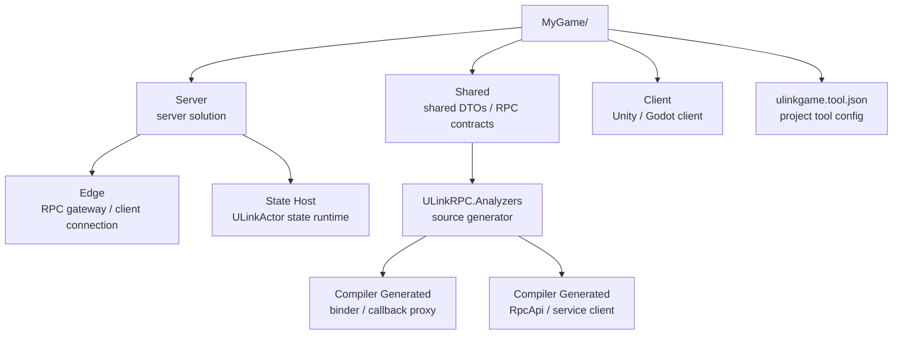
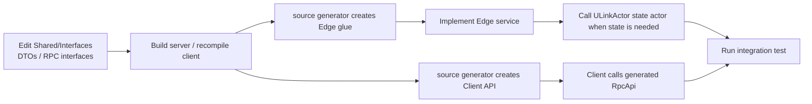

If all you need is for a client to call server methods, start with ULinkRPC.

Online games usually need another layer very quickly:

- players need a session after login
- clients need to reconnect after a disconnect
- important server notifications must not disappear during a disconnect window
- a .NET server usually needs a gateway or edge process, while in-process room, battle, or service state runs on the ULinkActor actor/mailbox runtime
- Unity, Godot, and plain .NET clients should not each reimplement reliable-push deduplication

ULinkGame is built for that layer. It does not write your account system, inventory, matchmaking rules, or gameplay logic for you. It wires up the infrastructure that online games repeatedly need.

One-sentence version:

**ULinkRPC provides strongly typed communication across client and server; ULinkActor provides the in-process actor/mailbox runtime; ULinkGame organizes them into a game-project shape with sessions, hosting, reconnects, and reliable push.**

## Prerequisites

Before you start, install the **.NET 10 SDK**:

- Download: https://dotnet.microsoft.com/en-us/download/dotnet/10.0

If you want to generate a Unity client, you also need:

- Unity 2022 LTS, or a compatible Unity version
- after opening the Unity project for the first time, run `NuGet -> Restore Packages`

If you want to generate a Godot client, you also need:

- Godot 4.x .NET

ULinkGame's project tool reuses `ULinkRPC.Starter` to generate the base RPC project, so install both tools:

```bash
dotnet tool install -g ULinkRPC.Starter
dotnet tool install -g ULinkGame.Tool
```

If they are already installed, update them:

```bash
dotnet tool update -g ULinkRPC.Starter
dotnet tool update -g ULinkGame.Tool
```

## Quick Start

For a first integration, use the easiest-to-debug combination:

- `unity`
- `websocket`
- `json`
- `simple` network profile
- `none` persistence

Run:

```bash
ulinkgame-tool new --name MyGame --client-engine unity --transport websocket --serializer json --persistence none
cd MyGame
dotnet run --project Server/Silo/Silo.csproj
```

Keep the state process running, then open a second terminal:

```bash
cd MyGame
dotnet run --project Server/Edge/Edge.csproj
```

Then open the client:

- open `MyGame/Client` in Unity
- wait for import to finish
- run `NuGet -> Restore Packages`
- open the default connection test scene
- click Play

If you chose Godot:

```bash
ulinkgame-tool new --name MyGame --client-engine godot --transport websocket --serializer json --persistence none
cd MyGame
dotnet run --project Server/Silo/Silo.csproj
```

Then start Edge in a second terminal:

```bash
cd MyGame
dotnet run --project Server/Edge/Edge.csproj
```

Then:

- open `MyGame/Client` in Godot 4.x .NET
- wait for Godot to generate and restore the C# project
- open the default scene
- click Play

The shortest path is:

**Install both tools -> generate the project -> start the state process -> start Edge -> open Client -> restore dependencies -> run the default test scene.**

## Understand The Generated Structure

A ULinkGame project extends the two-sided project generated by the ULinkRPC starter.



A typical project looks like this:

```text
MyGame/
  Shared/
    Interfaces/
  Server/
    Server.slnx
    Edge/
      Edge.csproj
      Program.cs
      Services/
    Silo/ or ActorHost/
      Silo.csproj or ActorHost.csproj
      Program.cs
  Client/
  ulinkgame.tool.json
```

Keep each layer's responsibility clear:

- `Shared/`
  Shared DTOs, RPC interfaces, and callback interfaces.
- `Server/Edge/`
  RPC entry points, connection ingress, callback binding, reliable business push, and session integration.
- `Server/Silo/` or `Server/ActorHost/`
  Authoritative state services. Newer projects should prefer `Server/State/` or `Server/ActorHost/` naming.
- `Client/`
  Unity or Godot project files, source-generator markers, and game scripts.
- `ulinkgame.tool.json`
  ULinkGame project options.

The easiest beginner mistake is putting everything into Edge. A sturdier split is:

- put network connections and RPC ingress in Edge
- put long-lived state and serialized logic in ULinkActor-based state actors
- keep shared contracts limited to DTOs and interfaces, not server implementations

## How ULinkRPC And ULinkGame Split Responsibilities

ULinkRPC solves communication:

- contract definition
- compile-time source generation
- RPC client/server glue
- transport
- serializer
- callback

ULinkGame solves game-session infrastructure:

- hosting RPC endpoints inside a .NET host
- composing an in-process actor/mailbox runtime on top of ULinkActor
- session identity and endpoint binding
- reliable business push outbox
- client-side reliable push inbox
- reconnect and state-lost results

The usual business-development flow is:

1. Define RPC contracts in `Shared/Interfaces/`.
2. Build the server or recompile the client so `ULinkRPC.Analyzers` generates RPC glue.
3. Implement server logic in `Server/Edge/Services/` or in ULinkActor-based state actors.
4. Call the generated `RpcApi` from the client.
5. Add reliable push and acknowledgements when you need important server notifications.

## Choose Project Options

Common `ulinkgame-tool new` options look like this:

```bash
ulinkgame-tool new --name MyGame \
  --client-engine unity \
  --transport websocket \
  --network-profile simple \
  --serializer json \
  --persistence none
```

Client engine options:

- `unity`
- `unity-cn`
- `tuanjie`
- `godot`

Transport options:

- `websocket`
- `tcp`
- `kcp`

Serializer options:

- `json`
- `memorypack`

Network profile options:

- `simple`
  The default. Generates one RPC endpoint. Recommended for a first integration.
- `realtime`
  Generates a split control/realtime project structure for high-frequency realtime gameplay.

Persistence options:

- `none`
  Default local-development shape, with no business database assumed.
- `postgres`
  Generates PostgreSQL connection configuration and package references.
- `mysql`
  Generates MySQL connection configuration and package references.

For a first integration, start with:

```bash
ulinkgame-tool new --name MyGame --client-engine unity --transport websocket --serializer json --persistence none
```

After the default connection test works, consider:

```bash
ulinkgame-tool new --name MyGame --client-engine unity --transport kcp --serializer memorypack --network-profile realtime --persistence postgres
```

Do not enable `kcp`, `memorypack`, `realtime`, and database persistence all at once on day one. Get the smallest path working first; upgrading later will be much easier.

## Start The Server

Generated projects usually have two server processes:

- `Edge`
  The RPC gateway, responsible for client connections and service-call ingress.
- state process
  Hosts ULinkActor-based room, battle, or long-lived service state.

Start the state process first:

```bash
cd MyGame
dotnet run --project Server/Silo/Silo.csproj
```

Then start Edge:

```bash
cd MyGame
dotnet run --project Server/Edge/Edge.csproj
```

The default `simple + websocket` setup starts one WebSocket RPC endpoint on Edge. The default client test script connects to that endpoint and calls a default service once.

If you changed transport:

- `websocket`
  Best for first integration and browser/WebSocket-friendly environments.
- `tcp`
  Closer to a traditional persistent TCP connection model.
- `kcp`
  Better for later low-latency realtime gameplay, but harder to debug at first.

## Start The Client

Unity and Tuanjie projects live under:

```text
MyGame/Client
```

After opening the project for the first time:

1. Wait for editor import to finish.
2. Wait for NuGetForUnity to import.
3. Run `NuGet -> Restore Packages`.
4. Open the default connection test scene.
5. Confirm that both the state process and Edge are running.
6. Click Play.

Godot projects also live under:

```text
MyGame/Client
```

For Godot:

1. Open the project with Godot 4.x .NET.
2. Wait for C# project generation and dependency restore.
3. Open the default scene.
4. Confirm that both the state process and Edge are running.
5. Click Play.

If the client cannot connect, check in this order:

1. Did the state process start successfully?
2. Did Edge start successfully?
3. Does the transport match the generated project options?
4. Is the WebSocket port already in use?
5. Did Unity run `NuGet -> Restore Packages`?
6. Did anyone manually edit the generated directory?

## Refresh RPC Glue During Development

Whenever you change RPC contracts under `Shared/Interfaces/`, rebuild the projects that depend on them. `ULinkRPC.Analyzers` generates the client API and server binder at compile time, so you do not need to run manual code generation.

For the server, usually run:

```bash
dotnet build Server/Edge/Edge.csproj
```

For Unity or Tuanjie, recompile the editor project. For Godot, usually run:

```bash
dotnet build Client/Client.csproj
```

The exact client `.csproj` name depends on the generated project.

Use a consistent development flow:



The rule is simple:

**If you changed a Shared contract, rebuild the server and recompile the client.**

Changes that require generated output to refresh include:

- adding an RPC service
- adding an RPC method
- changing a request or response DTO
- changing method parameters or return values
- adding a callback interface
- changing callback payloads

Changes that do not require regeneration include:

- changing only internal server query logic
- changing only internal ULinkActor state-actor logic
- changing only client UI
- changing only logs, configuration, or styling

Do not manually edit generated directories. Treat them as source artifacts generated from Shared contracts.

## A More Practical Extension Example

Assume the default connection test already works and you want to add your first real feature: querying a player profile.

The first step is to change `Shared/Interfaces/`, for example:

```csharp
using System.Threading.Tasks;
using ULinkRPC.Core;

namespace Shared.Interfaces;

public sealed class GetProfileRequest
{
    public long PlayerId { get; set; }
}

public sealed class GetProfileReply
{
    public long PlayerId { get; set; }
    public string DisplayName { get; set; } = string.Empty;
    public int Level { get; set; }
}

[RpcService(2)]
public interface IProfileService
{
    [RpcMethod(1)]
    ValueTask<GetProfileReply> GetProfileAsync(GetProfileRequest request);
}
```

Then immediately build the server so the source generator refreshes the binder:

```bash
dotnet build Server/Edge/Edge.csproj
```

Next, implement the service under `Server/Edge/Services/`. Conceptually, it looks like this:

```csharp
using Shared.Interfaces;

namespace Edge.Services;

public sealed class ProfileService : IProfileService
{
    public ValueTask<GetProfileReply> GetProfileAsync(GetProfileRequest request)
    {
        return new ValueTask<GetProfileReply>(new GetProfileReply
        {
            PlayerId = request.PlayerId,
            DisplayName = $"Player {request.PlayerId}",
            Level = 1
        });
    }
}
```

If this profile should be read from authoritative state, `ProfileService` should call a ULinkActor-based state actor or your project's own state service instead of putting long-lived state directly inside a normal RPC service implementation.

On the client, call the strongly typed API generated at compile time. The exact name depends on the source generator namespace settings, but the shape is:

```csharp
var reply = await rpc.Api.Shared.Profile.GetProfileAsync(
    new GetProfileRequest
    {
        PlayerId = 10001
    });
```

The important path is:

- contracts live in Shared
- glue code is generated by `ULinkRPC.Analyzers` at compile time
- Edge exposes RPC services
- ULinkActor state actors host authoritative state
- Client calls the generated API

## When To Use Reliable Push

Not every server notification needs reliable push.

Temporary logs, transient hints, and state that will be refreshed next frame can use normal callbacks.

These events usually should be handled reliably:

- match found
- room entered
- settlement completed
- reward granted
- mail arrived
- key business events that require the client to switch UI state

The reason is simple: reliable transport is not the same thing as reliable business handling.

For example, the server may write `Matched` to the connection just as the client reconnects. The old connection is gone, and the server does not know whether the client actually applied the event. The server may believe the player entered the room while the client is still waiting in matchmaking.

ULinkGame's reliable business push model is:

1. The server assigns an increasing sequence to each important push for each owner.
2. The server outbox stores pushes that have not been acknowledged.
3. The client only applies pushes newer than its local latest sequence.
4. After applying a push, the client acknowledges the latest sequence.
5. After reconnect, the server replays pending pushes.
6. If the client sees a duplicate sequence, it ignores it.

After the default RPC path works, read the dedicated reliable-push article:

- [Reliable Business Push: Why Reliable Transport Is Not Enough](/ULinkGame/posts/reliable-business-push/)

## Reconnect And State Lost

Beginners often think reconnect means reconnecting the socket. For online games, that is not enough.

The real questions are:

- is the session brought back by the client still valid?
- does the server still have compatible session state?
- can the reliable push sequence continue?
- can authoritative room, matchmaking, or settlement state be restored?

ULinkGame expresses these outcomes explicitly. Common results can be understood as:

- `Resumed`
  State is compatible. The session can continue, and pending pushes can be replayed.
- `StateRefreshRequired`
  The session is still valid, but the client's local transient state has expired and must be refreshed from an authoritative snapshot.
- `StateLost`
  The server can no longer validate the old state. The client must clear the old session and start again.

The point is to avoid pretending every disconnect can be recovered losslessly. When recovery is not possible, the server should tell the client to enter a new flow.

## Choose Simple Or Realtime

The default `simple` profile is a good fit for most first versions of online games:

- login
- account queries
- inventory
- mail
- shop
- lightweight matchmaking
- low-frequency room state
- turn-based or light realtime gameplay

It generates one RPC endpoint and keeps the mental model small.

The `realtime` profile is for games that clearly need a split control plane and realtime plane:

- the control endpoint handles login, matchmaking, room entry, settlement, and reliable business push
- the realtime endpoint handles input, snapshots, lockstep messages, or other high-frequency gameplay messages

If you are not sure you need this split yet, start with `simple`. Move to `realtime` when the need is clear.

## Choose JSON Or MemoryPack

For a first integration, use:

```bash
--transport websocket --serializer json
```

Reasons:

- errors are easier to read
- the transport path is easier to inspect
- Unity's first dependency import has fewer variables
- the default test is faster to get working

Once structure, connection, source generation, and business calls are stable, consider:

```bash
--transport websocket --serializer memorypack
```

Or:

```bash
--transport kcp --serializer memorypack
```

`MemoryPack` is better for performance-sensitive phases, but it is not recommended as the default for first-time debugging.

## Choose Persistence

The default `--persistence none` helps you get the local path working quickly.

If authoritative state or business data needs a database, choose:

```bash
--persistence postgres
```

Or:

```bash
--persistence mysql
```

ULinkGame only generates basic connection configuration and package references. It does not define your business tables.

These still belong to your game:

- account table
- character table
- inventory table
- leaderboard table
- order table
- room history
- battle records

ULinkGame should not take over your business schema.

## Files You Actually Maintain

In daily development, you mostly maintain:

- `Shared/Interfaces/`
  RPC interfaces, DTOs, and callback contracts.
- `Server/Edge/Services/`
  RPC service implementations, connection ingress, and reliable push integration.
- `Server/Silo/` or `Server/ActorHost/`
  Authoritative state and long-lived business state. Newer projects should prefer `Server/State/` or `Server/ActorHost/` naming.
- `Client/`
  Unity/Godot game scripts, UI, and scenes.
- `ulinkgame.tool.json`
  Usually only needed when project structure changes.

Do not manually maintain:

- ULinkRPC generated source in compiler output directories
- intermediate files generated by Unity, Godot, or the build system

When contracts change, rebuild. Do not treat RPC generated source as project source code.

## FAQ

### Why Install Both ULinkRPC.Starter And ULinkGame.Tool?

Because ULinkGame.Tool does not reinvent the lower-level RPC project template.

It first calls `ulinkrpc-starter` to generate a base `Shared + Server + Client` project, then adds the ULinkGame-owned pieces:

- `Server/Edge`
- `Server/Silo` or `Server/ActorHost`
- authoritative state service configuration
- ULinkGame runtime package references
- `ulinkgame.tool.json`
- `ULinkRPC.Analyzers` source-generator configuration

### Why Does The Server Usually Have Two Processes?

Because Edge and the state process have different responsibilities.

Edge faces client connections and is a good place for the RPC gateway, callbacks, session binding, and reliable push delivery.

The state process faces authoritative state and is a better place for player state, room state, matchmaking queues, leaderboards, and other long-lived state. In-process actor/mailbox execution is built on the separate ULinkActor package.

In local development they can run on the same machine. In production, you can scale them separately according to load and deployment boundaries.

### Can I Wire Up Only ULinkGame.Server By Hand?

Yes, but it is not recommended for a first integration.

Beginners should start with `ulinkgame-tool new` because it generates a runnable project structure in one step. After you understand how Edge, the state process, Shared, and Client relate to each other, manual restructuring is much safer.

### Does ULinkGame Implement Matchmaking And Rooms For Me?

No.

ULinkGame provides infrastructure that features such as matchmaking, rooms, rewards, and mail can use: session, reconnect, reliable push, and host integration.

Matchmaking rules, room rules, gameplay simulation, and product DTOs should still live in your game project.

## What To Read Next

After the default test works, continue in this order:

1. Add your own RPC service, such as `ProfileService` or `InventoryService`.
2. Practice the full `Shared -> source generation -> Edge service -> Client call` flow once.
3. Move long-lived state into an in-process actor based on ULinkActor.
4. Then add reliable push, reconnect, and state-lost handling.

Related guides:

- [Reliable Business Push: Why Reliable Transport Is Not Enough](/ULinkGame/posts/reliable-business-push/)
- [ULinkRPC Getting Started](/ULinkRPC/posts/ulinkrpc-getting-started/)

## Summary

The recommended ULinkGame starting path is clear:

1. Install `ULinkRPC.Starter` and `ULinkGame.Tool`.
2. Generate a project with `ulinkgame-tool new`.
3. First get the default test working with `simple + websocket + json + none`.
4. Develop business code in the `Shared -> source generation -> Edge/StateActor -> Client` order.
5. After the foundation is stable, upgrade to `memorypack`, `kcp`, `realtime`, or database persistence.

Do not rush to change the generated directory structure during the first integration. Get the tool-generated structure running, understand what each layer owns, then replace pieces with your own business code.
