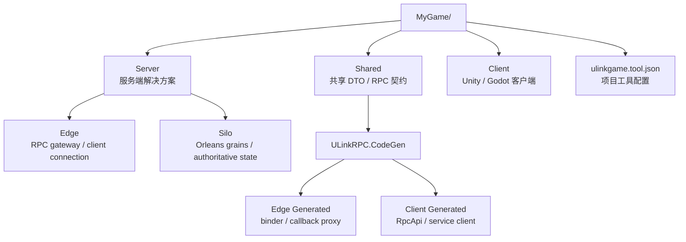
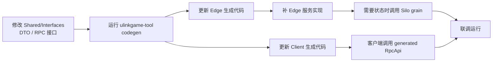

如果你只是想让客户端调用服务端方法，先看 ULinkRPC 就够了。

如果你要做的是在线游戏，事情很快会多出一层：

- 玩家登录后要有 session
- 客户端断线后要能重连
- 服务端重要业务通知不能因为断线窗口丢掉
- .NET 服务端通常需要 gateway / edge 进程和 Orleans silo
- Unity、Godot、plain .NET 客户端不应该各写一套可靠推送去重逻辑

ULinkGame 就是为这一层准备的。它不是替你写账号、背包、匹配规则或玩法逻辑，而是把在线游戏反复要搭的基础设施先接好。

一句话理解：

**ULinkRPC 负责双端强类型通信；Microsoft Orleans 负责分布式 actor；ULinkGame 负责把它们组织成更像游戏项目的会话和宿主结构。**

## 前提条件

开始之前，请先安装 **.NET 10 SDK**：

- 下载地址：https://dotnet.microsoft.com/en-us/download/dotnet/10.0

如果你要生成 Unity 客户端，还需要：

- Unity 2022 LTS，或兼容的 Unity 版本
- Unity 项目首次打开后执行 `NuGet -> Restore Packages`

如果你要生成 Godot 客户端，还需要：

- Godot 4.x .NET 版本

ULinkGame 的项目工具会复用 `ULinkRPC.Starter` 生成基础 RPC 项目，所以两个工具都要装：

```bash
dotnet tool install -g ULinkRPC.Starter
dotnet tool install -g ULinkGame.Tool
```

如果你已经安装过，可以更新：

```bash
dotnet tool update -g ULinkRPC.Starter
dotnet tool update -g ULinkGame.Tool
```

## Quick Start

第一次接入建议先用最容易排错的组合：

- `unity`
- `websocket`
- `json`
- `simple` network profile
- `none` persistence

直接照下面做：

```bash
ulinkgame-tool new --name MyGame --client-engine unity --transport websocket --serializer json --persistence none
cd MyGame
dotnet run --project Server/Silo/Silo.csproj
```

保持 Silo 进程运行，再打开第二个终端：

```bash
cd MyGame
dotnet run --project Server/Edge/Edge.csproj
```

然后打开客户端：

- 用 Unity 打开 `MyGame/Client`
- 等待导入完成
- 执行 `NuGet -> Restore Packages`
- 打开默认连接测试场景
- 点击 Play

如果你选的是 Godot：

```bash
ulinkgame-tool new --name MyGame --client-engine godot --transport websocket --serializer json --persistence none
cd MyGame
dotnet run --project Server/Silo/Silo.csproj
```

再开第二个终端启动 Edge：

```bash
cd MyGame
dotnet run --project Server/Edge/Edge.csproj
```

然后：

- 用 Godot 4.x .NET 打开 `MyGame/Client`
- 等待 Godot 生成并恢复 C# 工程
- 打开默认场景
- 点击 Play

最短路径可以记成：

**安装两个工具 -> 生成项目 -> 启动 Silo -> 启动 Edge -> 打开 Client -> 恢复依赖 -> 运行默认测试场景。**

## 先理解生成出来的结构

ULinkGame 项目是在 ULinkRPC starter 生成的双端项目上继续扩展出来的。



典型目录长这样：

```text
MyGame/
  Shared/
    Interfaces/
  Server/
    Server.slnx
    Edge/
      Edge.csproj
      Program.cs
      Generated/
      Services/
    Silo/
      Silo.csproj
      Program.cs
  Client/
  ulinkgame.tool.json
```

每一层的职责要分清：

- `Shared/`
  放双端共享的 DTO、RPC 接口和 callback 接口。
- `Server/Edge/`
  放 RPC 入口、连接接入、callback 绑定、可靠业务推送、session 接入逻辑。
- `Server/Silo/`
  放 Orleans silo 和 grain。适合承载玩家状态、房间状态、匹配队列等权威状态。
- `Client/`
  放 Unity 或 Godot 工程，以及客户端生成代码和业务脚本。
- `ulinkgame.tool.json`
  记录项目结构，供 `ulinkgame-tool codegen` 后续重新生成代码。

新手最容易踩的坑是把所有代码都塞进 Edge。更稳的拆法是：

- 网络连接和 RPC 接入放 Edge
- 长生命周期状态和可分布式扩展的逻辑放 Silo / grains
- 共享契约只放 DTO 和接口，不放服务端实现

## ULinkRPC 和 ULinkGame 怎么分工

ULinkRPC 解决的是通信问题：

- 契约定义
- 代码生成
- RPC client / server glue
- transport
- serializer
- callback

ULinkGame 解决的是游戏会话基础设施问题：

- .NET host 中托管 RPC endpoint
- Orleans client / silo 启动集成
- session identity 和 endpoint binding
- reliable business push outbox
- 客户端可靠推送 inbox
- reconnect / state-lost 这类状态结果

所以你开发业务时，顺序通常是：

1. 在 `Shared/Interfaces/` 定义 RPC 契约。
2. 运行 `ulinkgame-tool codegen`。
3. 在 `Server/Edge/Services/` 或 Silo grain 里实现服务端逻辑。
4. 在客户端调用生成的 `RpcApi`。
5. 需要重要服务端通知时，再接入 reliable push 和 ack。

## 生成项目时怎么选参数

`ulinkgame-tool new` 常用参数如下：

```bash
ulinkgame-tool new --name MyGame \
  --client-engine unity \
  --transport websocket \
  --network-profile simple \
  --serializer json \
  --persistence none
```

可选客户端：

- `unity`
- `unity-cn`
- `tuanjie`
- `godot`

可选 transport：

- `websocket`
- `tcp`
- `kcp`

可选 serializer：

- `json`
- `memorypack`

可选 network profile：

- `simple`
  默认选项，只生成一个 RPC endpoint。第一次接入建议用它。
- `realtime`
  生成控制连接和实时连接拆分的项目结构，适合高频实时玩法。

可选 persistence：

- `none`
  默认本地开发形态，不预设业务数据库。
- `postgres`
  生成 PostgreSQL 连接配置和相关包引用。
- `mysql`
  生成 MySQL 连接配置和相关包引用。

第一次接入建议先用：

```bash
ulinkgame-tool new --name MyGame --client-engine unity --transport websocket --serializer json --persistence none
```

等默认连接测试跑通后，再考虑：

```bash
ulinkgame-tool new --name MyGame --client-engine unity --transport kcp --serializer memorypack --network-profile realtime --persistence postgres
```

不要一开始就把 `kcp`、`memorypack`、`realtime`、数据库持久化一起打开。先把最小链路跑通，后面升级会容易很多。

## 服务端怎么启动

生成项目后，服务端有两个进程：

- `Silo`
  Orleans silo，承载 grains。
- `Edge`
  RPC gateway，负责客户端连接和服务调用入口。

先启动 Silo：

```bash
cd MyGame
dotnet run --project Server/Silo/Silo.csproj
```

再启动 Edge：

```bash
cd MyGame
dotnet run --project Server/Edge/Edge.csproj
```

默认 `simple + websocket` 会在 Edge 上启动一个 WebSocket RPC endpoint。客户端默认测试脚本会连接这个 endpoint 并调用一次默认服务。

如果你改了 transport：

- `websocket`
  更适合第一次接入和浏览器 / WebSocket 网络环境。
- `tcp`
  更接近传统长连接 TCP 模型。
- `kcp`
  更适合后续低延迟实时玩法，但第一次排错成本更高。

## 客户端怎么启动

Unity / 团结引擎项目在：

```text
MyGame/Client
```

首次打开后，按这个顺序处理：

1. 等待编辑器导入完成。
2. 等待 NuGetForUnity 导入完成。
3. 执行 `NuGet -> Restore Packages`。
4. 打开默认连接测试场景。
5. 确认 Silo 和 Edge 都在运行。
6. 点击 Play。

Godot 项目也在：

```text
MyGame/Client
```

Godot 侧按这个顺序处理：

1. 用 Godot 4.x .NET 打开项目。
2. 等待 C# 工程生成和依赖恢复。
3. 打开默认场景。
4. 确认 Silo 和 Edge 都在运行。
5. 点击 Play。

如果客户端连接失败，先按这个顺序排查：

1. Silo 是否已经启动成功。
2. Edge 是否已经启动成功。
3. transport 是否和生成项目时一致。
4. WebSocket 端口是否被占用。
5. Unity 是否执行过 `NuGet -> Restore Packages`。
6. 是否手改了 generated 目录。

## 日常怎么重新生成代码

只要你改了 `Shared/Interfaces/` 里的 RPC 契约，就要重新生成代码。

在项目根目录运行：

```bash
ulinkgame-tool codegen
```

如果本地工具已经恢复过，也可以跳过 restore：

```bash
ulinkgame-tool codegen --no-restore
```

如果你不在项目根目录，可以指定配置：

```bash
ulinkgame-tool codegen --config path/to/ulinkgame.tool.json
```

日常开发顺序建议固定下来：



判断是否需要 codegen 的方法很简单：

**只要改了 Shared 契约，就先跑 `ulinkgame-tool codegen`。**

需要重新生成的情况包括：

- 新增 RPC service
- 新增 RPC method
- 修改请求或响应 DTO
- 修改方法参数或返回值
- 新增 callback 接口
- 修改 callback payload

不需要重新生成的情况包括：

- 只改服务端内部查询逻辑
- 只改 Silo grain 内部状态处理
- 只改客户端 UI
- 只改日志、配置、样式

generated 目录不要手改。它们应该被看成由 Shared 契约生成出来的源码产物。

## 一个更实际的扩展示例

假设默认连接测试已经跑通，现在你要做第一个真实功能：查询玩家资料。

第一步应该改 `Shared/Interfaces/`，例如新增：

```csharp
using System.Threading.Tasks;
using ULinkRPC.Core;

namespace Shared.Interfaces;

public sealed class GetProfileRequest
{
    public long PlayerId { get; set; }
}

public sealed class GetProfileReply
{
    public long PlayerId { get; set; }
    public string DisplayName { get; set; } = string.Empty;
    public int Level { get; set; }
}

[RpcService(2)]
public interface IProfileService
{
    [RpcMethod(1)]
    ValueTask<GetProfileReply> GetProfileAsync(GetProfileRequest request);
}
```

然后立刻重新生成：

```bash
ulinkgame-tool codegen
```

再去 `Server/Edge/Services/` 补实现。概念上会像这样：

```csharp
using Shared.Interfaces;

namespace Edge.Services;

public sealed class ProfileService : IProfileService
{
    public ValueTask<GetProfileReply> GetProfileAsync(GetProfileRequest request)
    {
        return new ValueTask<GetProfileReply>(new GetProfileReply
        {
            PlayerId = request.PlayerId,
            DisplayName = $"Player {request.PlayerId}",
            Level = 1
        });
    }
}
```

如果这个资料要从 Orleans grain 读取，`ProfileService` 就应该通过 Orleans client 调用 Silo 里的 grain，而不是把长生命周期状态直接塞进 Edge 进程内存。

客户端侧则调用生成出来的强类型 API。具体命名会跟 codegen 输出有关，但思路是：

```csharp
var reply = await rpc.Api.Shared.Profile.GetProfileAsync(
    new GetProfileRequest
    {
        PlayerId = 10001
    });
```

这条线最重要的是：

- 契约在 Shared
- 胶水代码由 codegen 生成
- Edge 暴露 RPC 服务
- Silo 保存权威状态
- Client 调用 generated API

## reliable push 是什么时候用的

不是所有服务端通知都需要 reliable push。

普通日志、临时提示、下一帧还会刷新的状态，可以用普通 callback。

但这些事件通常应该可靠处理：

- 匹配成功
- 进入房间
- 结算完成
- 奖励到账
- 邮件到达
- 需要客户端切换 UI 状态的关键业务事件

原因是：transport 可靠不等于业务可靠。

例如服务端已经把 `Matched` 写进连接，但客户端刚好重连，旧连接断了，服务端不知道客户端有没有真的应用这个事件。结果可能是服务端认为玩家已经进房间，客户端还停在匹配中。

ULinkGame 的可靠业务推送模型是：

1. 服务端给每个 owner 的重要推送分配递增 sequence。
2. 服务端 outbox 保存还没确认的推送。
3. 客户端只应用比本地 latest sequence 更新的推送。
4. 客户端应用完成后 ack latest sequence。
5. 客户端重连后，服务端重放 pending 推送。
6. 客户端遇到重复 sequence 时直接忽略。

你可以先把默认 RPC 跑通，再读专门的可靠推送文章：

- [可靠业务推送：为什么传输可靠还不够](/ULinkGame/posts/reliable-business-push/)

## reconnect 和 state lost 要怎么理解

新手很容易把“重连”理解成重新连上 socket。在线游戏里这不够。

真正需要判断的是：

- 客户端带回来的 session 是否还有效
- 服务端是否还保留兼容的会话状态
- reliable push sequence 是否还能继续使用
- 房间、匹配、结算等权威状态是否还能恢复

ULinkGame 会把这类结果显式表达出来。常见结果可以粗略理解为：

- `Resumed`
  状态兼容，可以继续会话，并重放 pending 推送。
- `StateRefreshRequired`
  session 还有效，但客户端本地临时状态过期，需要拉取权威快照。
- `StateLost`
  服务端已经无法验证旧状态，客户端必须清理旧 session，重新开始。

这个设计的重点是：不要假装所有断线都能无损恢复。恢复不了时，要明确告诉客户端进入新流程。

## simple 和 realtime 怎么选

默认 `simple` profile 适合大多数第一版在线游戏：

- 登录
- 账号查询
- 背包
- 邮件
- 商店
- 轻量匹配
- 低频房间状态
- 回合制或弱实时玩法

它只生成一个 RPC endpoint，心智负担最小。

`realtime` profile 适合你明确需要拆分控制面和实时面的时候：

- 控制 endpoint 处理登录、匹配、房间进入、结算、可靠业务推送
- 实时 endpoint 处理输入、快照、帧同步或高频玩法消息

如果你还没确定自己需要实时拆分，就先用 `simple`。后续真的需要时，再迁移到 `realtime` 结构。

## 什么时候选 JSON，什么时候选 MemoryPack

第一次接入建议：

```bash
--transport websocket --serializer json
```

原因是：

- 错误更容易看懂
- 传输链路更容易排查
- Unity 首次导入依赖时变量更少
- 默认测试跑通更快

当你确认结构、连接、codegen 和业务调用都稳定后，再考虑：

```bash
--transport websocket --serializer memorypack
```

或者：

```bash
--transport kcp --serializer memorypack
```

`MemoryPack` 更适合性能敏感阶段，不建议作为第一次排错时的默认选择。

## 什么时候选 persistence

默认 `--persistence none` 是为了让你快速跑通本地链路。

如果你明确要让 Orleans grain state 或业务数据接入数据库，可以选择：

```bash
--persistence postgres
```

或：

```bash
--persistence mysql
```

注意：ULinkGame 只生成基础连接配置和包引用，不替你定义业务表。

这些仍然属于你的游戏：

- 账号表
- 角色表
- 背包表
- 排行榜表
- 订单表
- 房间历史
- 战斗记录

ULinkGame 不应该接管你的业务 schema。

## 你真正应该维护哪些文件

日常开发里，主要维护这些位置：

- `Shared/Interfaces/`
  RPC 接口、DTO、callback 契约。
- `Server/Edge/Services/`
  RPC 服务实现、连接入口、可靠推送接入。
- `Server/Silo/`
  Orleans grains、权威状态、长期业务状态。
- `Client/`
  Unity / Godot 业务脚本、UI、场景。
- `ulinkgame.tool.json`
  只有项目结构变化时才需要看。

不要手工维护这些位置：

- `Server/Edge/Generated/`
- `Client/Assets/Scripts/Rpc/Generated/`
- `Client/Scripts/Rpc/Generated/`

契约变了就重新生成，不要手改 generated。

## 常见问题

### 为什么要同时装 ULinkRPC.Starter 和 ULinkGame.Tool

因为 ULinkGame.Tool 不重新发明底层 RPC 项目模板。

它会先调用 `ulinkrpc-starter` 生成基础 `Shared + Server + Client` 项目，再在上面补充 ULinkGame 自己负责的内容：

- `Server/Edge`
- `Server/Silo`
- Orleans 配置
- ULinkGame runtime package 引用
- `ulinkgame.tool.json`
- 项目级 `codegen` 入口

### 为什么服务端要两个进程

因为 Edge 和 Silo 的职责不同。

Edge 面向客户端连接，适合处理 RPC gateway、callback、session binding、reliable push delivery。

Silo 面向权威状态，适合处理玩家状态、房间状态、匹配队列、排行榜等 Orleans grain。

本地开发时它们可以都跑在同一台机器上；生产环境里可以按压力和部署边界拆开扩展。

### 可以不用 Orleans 吗

ULinkGame 的主要服务端定位就是把 ULinkRPC 和 Microsoft Orleans 组合起来。如果你完全不需要 Orleans，只想要一个最小 RPC server，直接用 ULinkRPC starter 更简单。

### 可以只装 ULinkGame.Server 包手工接吗

可以，但不建议作为第一次接入方式。

新手更应该从 `ulinkgame-tool new` 开始，因为它会一次性生成可运行的项目结构。等你理解 Edge、Silo、Shared、Client 的关系后，再手工拆改会稳很多。

### ULinkGame 会帮我做匹配和房间吗

不会。

ULinkGame 提供的是匹配、房间、奖励、邮件这些业务都可能用到的基础设施，例如 session、reconnect、reliable push、host integration。

匹配规则、房间规则、玩法模拟和产品 DTO 仍然应该放在你的游戏项目里。

## 接下来继续看什么

默认测试跑通后，建议按这个顺序继续：

1. 先新增一个自己的 RPC service，例如 `ProfileService` 或 `InventoryService`。
2. 练习一次 `Shared -> codegen -> Edge service -> Client call` 的完整流程。
3. 再把长期状态迁移到 Silo grain。
4. 最后再接入 reliable push、reconnect 和 state-lost 处理。

相关指南：

- [可靠业务推送：为什么传输可靠还不够](/ULinkGame/posts/reliable-business-push/)
- [ULinkRPC 入门教程](/ULinkRPC/posts/ulinkrpc-getting-started/)

## 最后总结

ULinkGame 的推荐起步方式很明确：

1. 安装 `ULinkRPC.Starter` 和 `ULinkGame.Tool`。
2. 用 `ulinkgame-tool new` 生成项目。
3. 先用 `simple + websocket + json + none` 跑通默认测试。
4. 按 `Shared -> codegen -> Edge/Silo -> Client` 的顺序开发业务。
5. 等基础链路稳定后，再升级到 `memorypack`、`kcp`、`realtime` 或数据库持久化。

第一次接入不要急着改目录结构。先让工具生成的结构跑起来，理解每一层的职责，再开始替换成自己的业务。
